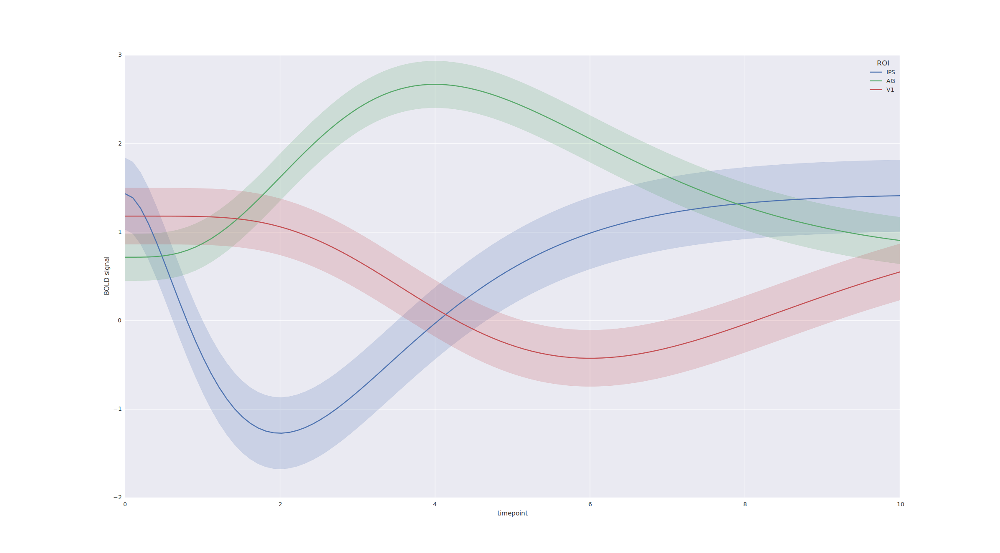

##########################################
Libhugin Metadaten Such- und Analysesystem
##########################################

Allgemeines zum System
======================

Die zu evaluierende Bibliothek *libhugin* wurde entworfen, weil es mit den
aktuellen Applikationen zur Metadaten Beschaffung und Pflege immer wieder zu
Probleme kommt. Oft werden beispielsweise ausländische Filme nicht gefunden, die
Inhaltsbeschreibung liegt nur in einer bestimmten Sprache vor oder es kommt zu
Redundanzen bei den Metadaten, wenn auf mehrere Onlinequellen parallel
zugegriffen wird (vgl. :cite:`cpiechula`). Zu den bekannten Applikationen
(Abspielsoftware), sogenannte Media--Center, gehören beispielsweise das
XBMC--Media--Center oder das Windows--Media--Center.

Bei der entwickelten Bibliothek wird eine andere Herangehensweise im Vergleich
zu den bereits existierenden Applikationen gezeigt. Es wurde ein modulares
System entworfen, welches sich nach dem Baukastenprinzip an die jeweiligen
Anforderungen gut anpassen lässt. Das Konzept der Metadatenbeschaffung wurde
gleichzeitig um die Funktionalität der Metadatenaufbereitung erweitert.

Die Bibliothek wurde in die zwei Teile *libhugin--harvest*
(Metadatenbeschaffung) und *libhugin--analyze* (Metadatenaufbereitung)
aufgeteilt. Der *libhugin-harvest* Teil der Bibliothek ist um die folgenden drei
Pluginarten erweiterbar:

    * Provider, Zugriff auf Onlinequellen.
    * Postprocessor, Manipulation der Metadaten direkt nach dem Herunterladen.
    * Converter, Unterstützung verschiedener Metadaten--Exportformate.

Der *libhugin-analyze* Teil der Bibliothek dient zur nachträglichen
Manipulation und Analyse der Metadaten, hier gibt es die Möglichkeit folgende
Pluginarten zu implementieren:

    * Analyzer, Analyse der Metadaten.
    * Modifier, Direkte Modifikation der Metadaten.
    * Comparator, Vergleich der Metadaten verschiedener Filme untereinander.

Die Bibliothek wurde in der Programmiersprache Python (Version 3.3) entworfen.

Filmsuche Algorithmik
=====================

Bei der Suchanfrage über den Filmtitel wird von den Onlinequellen in der Regel
eine Liste mit mehreren Möglichkeiten geliefert. Das Provider--Plugin muss
anschließend die Filmtitel mit der größten Übereinstimmung herausfinden. Für die
Ähnlichkeit bei der Suche nach übereinstimmenden Zeichenketten, wurde ein
Ähnlichkeitsmaß definiert welches von 0.0 (keine Ähnlichkeit) bis 1.0
(Übereinstimmung) geht.

Der Vergleich der Zeichenketten sollte möglichst fehlertolerant sein und
Zeichenketten mit der höhten Übereinstimmung liefern.

Der simple Vergleich

::

    "The Matrix" ==  "The Matrix"

würde hier nur bei exakt den gleichen Zeichenketten funktionieren. Für den
Vergleich von Zeichenketten bietet die Python Standard--Bibliothek das
*difflib*--Modul. Das Modul erlaubt es zwei Sequenzen zu vergleichen. Es
arbeitet mit dem Ratcliff--Obershelp--Algorithmus und hat eine Komplexität von
:math:`O(n^{3})` im *worst case* und eine erwartete Komplexität von
:math:`O(n^{2})`. Der Algorithmus basiert auf der Idee, die Sequenzen der
übereinstimmenden Zeichen zu und durch die Anzahl alle Zeichen der beiden
Strings zu teilen.

Ein weiterer Algorithmus der für Zeichenkettenvergleiche eingesetzt wird ist der
Levenshtein--Algorithmus (Levenshtein--Distanz). Der Algorithmus hat eine
Laufzeit von :math:`O(nm)`. Die Levenshtein--Distanz basiert auf der Idee, der
minimalen Editiervorgänge (Einfügen, Löschen, Ersetzen) um von einer
Zeichenkette auf eine andere zu kommen. Die normalisierte Levenshtein--Distanz
bewegt sich zwischen 0.0 (Übereinstimmung) und 1.0 (keine Ähnlichkeit).

Eine Erweiterung der Levenshtein--Distanz ist die Damerau--Levenshtein--Distanz.
Diese wurde um die Funktionalität erweitert, vertauschte Zeichen zu erkennen.
Um die Zeichenkette *,,The Matrix"* nach *,,Teh Matrix"* zu überführen, sind bei
der Levenshtein--Distanz zwei Operationen nötig, die
Damerau--Levenshtein--Distanz hingegen benötigt nur eine Operation.

Da es bei der Filmsuche zu vielen Zeichenkettenvergleichen kommt, und auch nicht
abgesehen werden kann um beispielsweise welche Data--Mining--Plugins *libhugin*
in Zukunft erweitert wird, sollte der Algorithmus, zum Vergleich von
Zeichenketten, eine gute Laufzeit bieten. Um die jeweiligen Algorithmen
beziehungsweise die Implementierungen dieser, bezüglich der Performance, zu
überprüfen wurde eine Messung mit den folgenden zwei unter Python verfügbaren
Implementierungen durchgeführt:

    * difflib, Modul aus der Python--Standard--Bibliothek  (Ratcliff-Obershelp)
    * pyxDamerauLevenshtein, auf Cython basierte der Damerau--Levenshtein--Implementierung

.. _fig-stringcompare:

    String comparsion algorithms performance anlysis.

Je nach Algorithmus variiert das Ergebnis leicht, das liegt daran dass die
Algorithmen eine unterschiedliche Idee verfolgen.

Folgende interaktive Python--Sitzung zeigt das Ergebnisverhalten von difflib und
pyxDamerauLevenshtein, da das Ähnlichkeitsmaß beim der zu letzt genannten
Implementierung umgekehrt ist, wird das Ergebnis von der eins abgezogen um das
Verhalten zu vergleichen:

.. code-block:: python

    >>> difflib.SequenceMatcher(None, "Katze", "Fratze").ratio()
    0.7272727272727273
    >>> 1 - normalized_damerau_levenshtein_distance("Katze", "Fratze")
    0.6666666666666667

Weitere Werte für die um die unterschiedliche Wertung der beiden Algorithmen zu
zeigen finden sich in der Tabelle (siehe Abbildung).

Da der Vergleich case sensitive ist fällt die Ähnlichkeit der Titel *,,Sin"*
und *,,sin"*, wie folgende Python Sitzung zeigt, unterschiedlich aus:

.. code-block:: python

    >>> 1 - normalized_damerau_levenshtein_distance("sin", "Sin")
    0.6666666666666667

Um dieses Problem zu beheben wird die gesuchte Zeichenkette vor dem Vergleich
normalisiert. Dies geschieht indem alle Zeichen der Zeichenkette in Klein--
beziehungsweise Großbuchstaben umgewandelt werden. Folgendes Beispiel zeigt die
Normalisierung mittels der in Python integrierten ``lower()``--Funktion:

.. code-block:: python

    >>> 1 - normalized_damerau_levenshtein_distance("sin".lower(), "Sin".lower())
    1.0

Während der Entwicklung ist aufgefallen, dass der implementierte OFDb--Provider
den Film *,,The East (2013)"* nicht finden konnte. Nach längerer Recherche und
Ausweitung der gewünschten Ergebnisanzahl auf 100, wurde festgestellt, dass der
Film auf dem letzten Platz der Suchergebnisse (Platz 48) zu finden war.

Dies liegt daran liegt, dass der Film auf dieser Online--Plattform mit der
Schreibweise *,,East, The"* gepflegt ist. Dies ist eine valide und nicht
unübliche Schreibweise um Filme alphabetisch schneller zu finden.

Betrachtet man die Ähnlichkeit der beiden Zeichenketten, so stellt man fest,
dass bei dieser Schreibweise, je nach Algorithmus, eine geringe bis gar keine
Ähnlichkeit vorhanden ist, wie folgende *IPython* Sitzung zeigt:

.. code-block:: python

    >>> import difflib
    >>> from pyxdameraulevenshtein import normalized_damerau_levenshtein_distance
    >>> difflib.SequenceMatcher(None, "The East", "East, The").ratio()
    0.47058823529411764
    >>> 1 - normalized_damerau_levenshtein_distance("The East", "East, The")
    0.0

Um dieses Problem zu Umgehen, müssen die Filmtitel auf ein bestimmtes Schema
normalisiert werden. Um dieses Problem zu beheben wäre ein möglicher Ansatz den
Artikel zu entfernen. Dies würde jedoch das Problem mit sich bringen, dass Filme
wie *,,Drive (2011)"* und *"The Drive (1996)"* fälschlicherweise als identisch
erkannt werden würden. Ein weiteres Problem, welches hinzu kommt ist, dass der
Artikel--Ansatz sprachabhängig wäre.

Ein anderer Ansatz hier wäre, Satztrennungszeichen zu entfernen und den
einzelnen Wörter des Titels alphabetisch zu sortieren.

Aus *,,East, The"* und *,,The East"* wird nach der Normalisierung also *,,east
the"*. Der Vergleich der Zeichenkette würde eine Ähnlichkeit von 1.0 liefern.

Anhand des Beispieltitels *,,East, The"* wird wie folgt die Normalisierung
erläutert:

    1. Titel auf Kleinschreibung runterbrechen →  ``'east, the'``
    2. Satztrennungszeichen wie ,,,", ,,-" und ,,:" werden entfernt → ``'east the'``
    3. Titel anhand der Leerzeichen aufbrechen und in Liste umgewandeln → [``'east '``, ``'the'``]
    4. Führende und nachfolgende Leerzeichen entfernen → [``'east'``, ``'the'``]
    5. Liste alphabetisch sortieren und in Zeichenkette umwandeln → ``'east the'``

Wendet man diesen Ansatz auf ,,The East" und ,,East, The" an so erhält man in
beiden Fällen die Zeichenkette "east the". Die Umsetzung des Algorithmus bei der
Titelsuche löst das Problem beim OFDb--Provider. Der eben genannte Film wird
durch die Normalisierung gefunden und erscheint an der ersten Position.

Diese Vorgehensweise Normalisiert ebenso die Personensuche. Hier wird
beispielsweise der Name *,,Emma Stone"* und *,,Stone, Emma"* in beiden Fällen zu
der Zeichenkette ``'emma stone'``.

Unschärfesuche
==============

text.

IMDB--ID Suche
==============

text.

Asynchrone Ausführung
=====================

Bestimmte Teile von *libhugin* wurden multithreaded entwickelt. Hierzu zählen
die Downloadqueue so wie die Möglichkeit die Suchanfrage asynchron
loszuschicken.

Da der Zugriff auf Onlinequellen je nach Serverauslastung und Internetanbindung
in der Performance stark variiert, wurde das Herunterladen der Metadaten
parallelisiert. Das parallele Herunterladen zeigt deutliche
Geschwindigkeitsvorteile im Vergleich zur seriellen Verarbeitung (siehe
Abbildung :num:`fig-threaded-download`).

Normalisierung der Metadaten
============================

Die Normalisierung der Metadaten aus unterschiedlichen Quellen ist sehr
schwierig, da es bei den Filmmetadaten keinen einheitlichen Standard gibt. Um
fehlerhafte oder fehlende Metadaten über unterschiedliche Quellen zu ergänzen,
müssen die Metadaten normalisiert werden. Dieses Problem wird nun Anhand vom
Genre Attribut, welches in der internen Metadaten--Datenbank des XBMC abgelegt
wurde, beispielhaft erklärt.

Wird beispielsweise der Spielfilm ,,The Matrix (1999)" über drei verschiedene
Onlinequellen bezogen, so erhält man, falls das Genre ,,Science Fiction" bei den
jeweiligen Quellen gepflegt wurde, oft eine unterschiedliche Schreibweise.

    * TMDb (www.themoviedb.org): Science Fiction
    * IMDb (www.imdb.com): Sci--Fi
    * OFDb (www.ofdb.de): Science--Fiction

Wird nun der Film ,,The Matrix (1999)" über TMDb bezogen und der Film ,,Matrix
Revolutions (2003)" über IMDb, weil er beispielsweise bei TMDb nicht gepflegt
ist, so wird in diesem Fall das Genre mit den zwei unterschiedlichen
Schreibweisen ,,Science Fiction" und ,,Sci--Fi" bezogen.

Durch diesen Umstand haben wir eine Genreinformation redundant in unserem
XBMC--Center gepflegt. Es ist also nicht mehr möglich dieses Filmgenre eindeutig
zu identifizieren. Es ist somit weder eine Gruppierung nach diesem Genre noch
eindeutige eindeutige Filterung möglich.

Dieses Problem betrifft grundsätzlich alle Filmmetadaten Attribute, jedoch
lassen sich andere Attribute wie die Inhaltsbeschreibung problemlos austauschen,
diese von Natur aus individuell und sich somit nicht normalisieren lässt.

Da das Filmgenre, neben der Inhaltsbeschreibung, zu den wichtigsten
Auswahlkriterien bei Filmen zählt, wurde hier bei *libhugin* ein statisches
Konzept der Normalisierung umgesetzt.

Die Normalisierung bei *libhugin* bildet hierzu jedes Genre einer Onlinequelle
auf einem Globalen Genre ab. Die Normalisierung erfolgt über eine statische
Genre--Tabelle, welche der Autor eines Provider--Plugins (Plugin um eine
bestimmte Onlinequellen anzusprechen) bereitstellen muss. Der Nachteil dieser
Variante ist, dass das Genre--Spektrum der Onlinequelle bekannt sein muss.

Das Provider Genre wird über einen Index auf einem globalen Genre abgebildet.
Folgendes Beispiel zeigt ausschnittsweise den Abbildungsansatz:

::

    Globale Genre Tabelle           Provider Tabelle mit Mapping
    =====================           ============================

    1, Science Fiction              21, Sex
    2, Komödie                      22, 3D-Animation
    3, Actionfilm                   2, Comedy
    [...]                           20, Drama
    20, Drama                       1, Sci-Fi
    21, Erotik
    22, Animation

Die Abbildung erfolgt anhand des Indizes:

::

    3D-Animation    --- wird zu --->    Animation
    Comedy          --- wird zu --->    Komödie
    Drama           --- wird zu --->    Drama
    Sci-Fi          --- wird zu --->    Science Fiction
    Sex             --- wird zu --->    Erotik

Wird keine ,,Genremapping--Tabelle" bereitgestellt, so kann das Genre nicht
normalisiert werden. In diesem Fall kann es zu der oben genannten Problematik
kommen. Das Genremapping muss pro Sprache gepflegt werden, der Prototyp besitzt
im aktuellen Zustand eine globale Genre--Tabelle für die deutsche und die
englische Sprache.

Ein weiterer Ansatz bei der Genrenormalisierung war die automatische Erkennung
des Genres Anhand der Wortähnlichkeit. Dies erwies sich jedoch als nicht
praxistauglich. Eine automatische Genreerkennung benötigt eine Wortschatz aus
Referenz--Genres, mit welchen das ,,unbekannte" Provider--Genre verglichen werden
muss. Bei Genres wie Science Fiction, Drama oder Thriller funktioniert das
System noch relativ gut, komme aber seltene oder unbekannte Genrenamen wie
,,Mondo" oder ,,Suspense" hinzu, kann je nach Referenz--Wortschatz keine
Übereinstimmung mehr erfolgen. Hier wäre noch eine semiautomatischer Ansatz
denkbar, welcher automatisiert Genres erkennt und im Fall eines Unbekannten
Genres dieses in eine Liste aus nicht zugeordneten Genres hinzufügt, welche dann
vom Benutzer ,,korrigiert" werden kann. Dies ist jedoch bei einer
Software--Bibliothek wie sie durch *libhugin* bereitgestellt wird, weniger
praktikabel.

** semi auto difflib example**

Ein weiteres Problem das hier jedoch hinzu kommt ist, dass das ,,Genre" an sich
in keiner Form standardisiert ist. Je nach Onlinequelle gibt es
Genrebezeichnungen wie Animationsfilm oder Kinderfilm, welche jedoch im engeren
Sinne aber nicht zum ,,Filmgenre"--Begriff gezählt werden dürften. Des Weiteren
kommt hinzu, dass über die Jahre immer wieder neue Genre entstanden sind.

