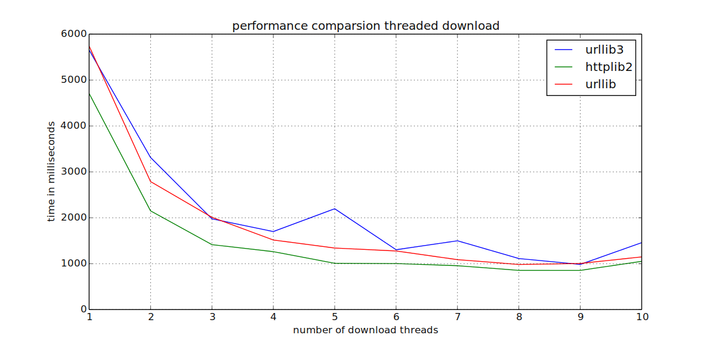

############################
Technische Grundüberlegungen
############################

Bestimmte Teile von *libhugin* wurden multithreaded entwickelt. Hierzu zählen
die Downloadqueue so wie die Möglichkeit die Suchanfrage asynchron
loszuschicken.

Auf weiteren Einsatz von Multithreading wurde verzichtet, da parallele
Verarbeitung unter Python aufgrund vom *GIL* (Global Inetpreter Lock) nur
eingeschränkt möglich ist. Der *GIL* ist ein Mutex, welcher verhindert dass
mehrere native Threads Python Bytecode gleichzeitig ausführen können. Die
Parallelisierung beispielsweise von Funktionen kann sogar zu Performanceeinbußen
im Vergleich zur Singlethreaded--Ausführung führen.

Diese Einschränkung gilt jedoch nicht für lange laufende oder blockierende
Operationen wie beispielsweise der Zugriff auf die Festplatte (vgl.
:cite:`hellmann2011python`).

Da der Zugriff auf Onlinequellen je nach Serverauslastung und Internetanbindung
in der Performance stark variiert, wurde das Herunterladen der Metadaten
parallelisiert. Das parallele Herunterladen zeigt deutliche
Geschwindigkeitsvorteile im Vergleich zur seriellen Verarbeitung (siehe
Abbildung :num:`fig-threaded-download`).

Zum Herunterladen wird auf die Python HTTP--Bibliothek verzichtet, weil diese
grundlegende HTTP--Standards, wie beispielsweise Kompression, nicht
unterstützt. Zwei weitere HTTP--Bibliotheken unter Python sind beiden freien
Implementierungen *urllib3* und *httplib2*, auf welche zurückgegriffen werden
kann.
Kompression und Caching sind insofern wichtig, da sich beide Funktionen auf das
Downloadverhalten auswirken. Bei aktivierter Kompression, hier ist im
RFC1950-RFC1952 der *deflate* und *gzip* Algorithmus vorgesehen, wird der Inhalt
vor dem versenden komprimiert und auf Empfängerseite ,,transparent"
dekomprimiert. Textdateien lassen sich in der Regel gut komprimieren. Durch die
Kompression müssen wenigen Daten übertragen werden was sich bei großen
Datenmengen und einer geringen Bandbreite auf die Performance auswirken kann.

Folgende Python--Sitzung zeigt wie die Standard HTTP--Bibliothek den
komprimierten Inhalt enthält, es aber nicht schafft diesen zu dekomprimieren
weil hier das Feature fehlt:

.. code-block:: python

   from urllib.request import urlopen
   urlopen('http://httpbin.org/gzip').read()
   b'\x1f\x8b\x08\x00\xc0\xa5\x8bS\x02\xff5\x8f\xc1n\x830\x10D\xef\xf9\n\xe4s\xec\[...]'

Im Gegenzug dazu der Zugriff über *urllib3*-- und *httplib2*--Bibliothek auf die
gleiche Ressource:

.. code-block:: python

   from httplib2 import Http
   Http().request('http://httpbin.org/gzip')
   b'{\n  "gzipped": true,\n  "headers": {\n    "Accept-Encoding": "gzip, deflate"[...]'

   import urllib3
   urllib3.PoolManager(1).request(url='http://httpbin.org/gzip', method='GET').data
   b'{\n  "gzipped": true,\n  "headers": {\n    "Accept-Encoding": "identity",\n [...]'

Ein weiteres Feature der *urllib3*--Bibliothek ist, dass diese im Vergleich zu
den anderen beiden Bibliotheken Thread--Safe ist. Alternativ kann hier jedoch
bei den anderen beiden Bibliotheken eine separate Instanz pro Thread gestartet
werden. Wie und ob sich das auf die Performance auswirkt zeigt der Vergleich der
drei Bibliotheken beim parallelen Herunterladen (siehe Abbildung
:num:`fig-threaded-download`). Hier wird der ,,Pooling" Mechanismus der
*urllib3*--Bibliothek verwendent. Die anderen Bibliotheken werden lokal pro
Thread gestartet (siehe Anhang ).

.. _fig-threaded-download

    Performancevorteil beim Parellisieren von Downloads.

Der Benchmark wurde mit einer *VDSL* 50Mbit--Leitung durchgeführt.

#####################
Algorithmik Filmsuche
#####################

Für die Suche nach Filmmetadaten gibt es unter *libhugin* mehrere Möglichkeiten.
Je nach Metadaten--Provider ist eine Suche nach IMDb--ID und Titel möglich.

Folgende Python--Shell Sitzung zeigt wie eine Metadaten Suchanfrage
funktioniert:

.. code-block:: python

    >>> from hugin.harvest.session import Session
    >>> s = Session()
    >>> q = s.create_query(title='The Matrix')
    >>> r = s.submit(q)
    print(r)
    [<tmdbmovie <picture, movie> : The Matrix (1999)>,
     <ofdbmovie <movie> : Matrix (1999)>,
     <filmstartsmovie <movie> : Matrix (1999)>]

Beim Erstellen der Sitzung können *libhugin* Konfigurationparameter wie ,,Cache
Pfad", ,,Anzahl der zu verwendenden Threads", ,,Anzahl paralleler Downloads per
Thread" so wie noch weitere globale Konfigurationsparameter übergeben werden.

Anschließend muss eine Suchanfrage erstellt werden. Dazu gibt es die Möglichkeit
die Methode ``create_query()`` zur Hilfe zu nehmen. Hier hat der Benutzer eine
Vielzahl von Möglichkeiten seine Suchanfrage zu konfigurieren (siehe
:cite:`cpiechula`).

Der letzte Schritt ist das losschicken der Suchanfrage. Hier gibt es die
Möglichkeit eine *synchrone* (wie im Beispiel) oder eine *asynchrone* Anfrage
loszuschicken. Der Hauptunterschied ist, dass die *asynchrone* Anfrage im
Gegensatz zu der *synchronen* nicht blockt, der Aufrufen kann also in der
Zwischenzeit andere Sachen ,,erledigen".

Standardsuche
=============

Bei der Suchanfrage über den Filmtitel wird von den Onlinequellen in der Regel
eine Liste mit mehreren Möglichkeiten geliefert. Das Provider--Plugin muss
anschließend die Filmtitel mit der größten Übereinstimmung herausfinden. Für die
Ähnlichkeit bei der Suche nach übereinstimmenden Zeichenketten, wurde ein
Ähnlichkeitsmaß definiert welches von 0.0 (keine Ähnlichkeit) bis 1.0
(Übereinstimmung) geht.

Der Vergleich der Zeichenketten sollte möglichst fehlertolerant sein und
Zeichenketten mit der höhten Übereinstimmung liefern.

Der simple Vergleich

::

    "The Matrix" ==  "The Matrix"

würde hier nur bei exakt den gleichen Zeichenketten funktionieren. Für den
Vergleich von Zeichenketten bietet die Python Standard--Bibliothek das
*difflib*--Modul. Das Modul erlaubt es zwei Sequenzen zu vergleichen. Es
arbeitet mit dem Ratcliff--Obershelp--Algorithmus und hat eine Komplexität von
:math:`O(n^{3})` im *worst case* und eine erwartete Komplexität von
:math:`O(n^{2})`. Der Algorithmus basiert auf der Idee, die Sequenzen der
übereinstimmenden Zeichen zu und durch die Anzahl alle Zeichen der beiden
Strings zu teilen.

Ein weiteres Maß für die Ähnlichkeit von Zeichenketten ist die Hemming--Distanz.
Diese Distanz arbeitet nach der Idee die ,,Ersetzungen" zu zählen. Der
Algorithmus hat jedoch die Einschränkung, dass er sich nur auf gleich lange
Zeichenketten anwenden lässt (vgl. :cite:`navarro2001guided`,
:cite:`ranka2009ic3`).

Ein weiterer Algorithmus der für Zeichenkettenvergleiche eingesetzt wird ist der
Levenshtein--Algorithmus (Levenshtein--Distanz). Der Algorithmus hat eine
Laufzeit von :math:`O(nm)`. Die Levenshtein--Distanz basiert auf der Idee, der
minimalen Editiervorgänge (Einfügen, Löschen, Ersetzen) um von einer
Zeichenkette auf eine andere zu kommen (vgl :cite:`atallah2010algorithms`,
:cite:`navarro2001guided`, :cite:`ranka2009ic3`). Die normalisierte
Levenshtein--Distanz bewegt sich zwischen 0.0 (Übereinstimmung) und 1.0 (keine
Ähnlichkeit).

Eine Erweiterung der Levenshtein--Distanz ist die Damerau--Levenshtein--Distanz.
Diese wurde um die Funktionalität erweitert, vertauschte Zeichen zu erkennen.
Um die Zeichenkette *,,The Matrix"* nach *,,Teh Matrix"* zu überführen, sind bei
der Levenshtein--Distanz zwei Operationen nötig, die
Damerau--Levenshtein--Distanz hingegen benötigt nur eine Operation wie die
folgende *IPython*--Sitzung zeigt:

.. code-block:: python

    >>> from pyxdameraulevenshtein import damerau_levenshtein_distance
    >>> from distance import levenshtein as levenshtein_distance
    >>> levenshtein_distance("the matrix", "teh matrix")
    >>> 2
    >>> damerau_levenshtein_distance("the matrix", "teh matrix")
    >>> 1

Da es bei der Filmsuche zu vielen Zeichenkettenvergleichen kommt, und auch nicht
abgesehen werden kann um beispielsweise welche Data--Mining--Plugins *libhugin*
in Zukunft erweitert wird, sollte der Algorithmus, zum Vergleich von
Zeichenketten, eine gute Laufzeit bieten.

Da der Raspberry Pi als Zielplattform nicht ausgeschlossen ist, sollte die
Implementierung des Algorithmus zum Vergleich von Zeichenketten möglichst
performant sein.

Um die jeweiligen Algorithmen, beziehungsweise die Implementierungen dieser,
bezüglich der Performance, zu überprüfen wurde eine Messung mit den folgenden
unter Python verfügbaren Implementierungen durchgeführt:

    * difflib, Modul aus der Python--Standard--Bibliothek  (Ratcliff-Obershelp)
    * pyxDamerauLevenshtein, auf Cython basierte der Damerau--Levenshtein--Implementierung
    * distance, externes Modul mit Levenshtein--Implementierung in Python und C

.. _fig-stringcompare:

.. figure:: fig/algo_compare.pdf
    :alt: String comparsion algorithms.
    :width: 100%
    :align: center

    String comparsion algorithms performance anlysis.

Je nach Algorithmus variiert das Ergebnis leicht, das liegt daran dass die
Algorithmen eine unterschiedliche Idee verfolgen.

Folgende interaktive Python--Sitzung zeigt das Ergebnisverhalten von difflib und
pyxDamerauLevenshtein, da das Ähnlichkeitsmaß beim der zu letzt genannten
Implementierung umgekehrt ist, wird das Ergebnis von der eins abgezogen um das
Verhalten zu vergleichen:

.. code-block:: python

    >>> difflib.SequenceMatcher(None, "Katze", "Fratze").ratio()
    0.7272727272727273
    >>> 1 - normalized_damerau_levenshtein_distance("Katze", "Fratze")
    0.6666666666666667

Weitere Werte für die um die unterschiedliche Wertung der beiden Algorithmen zu
zeigen finden sich in der Tabelle Abbildung :num:`fig-comparsion-diff`.

.. figtable::
    :label: fig-comparsion-diff
    :caption: Ähnlichkeitswerte Ratcliff-Obershelp (links unten) und Damerau-Levenshtein (rechts oben)
    :alt: Ähnlichkeitswerte Ratcliff-Obershelp (links unten) und Damerau-Levenshtein (rechts oben)

    +---------------+--------------+------------+--------------+---------------+
    |               | **Superman** | **Batman** | **Iron-Man** | **Spiderman** |
    +===============+==============+============+==============+===============+
    | **Superman**  | 1.0          | 0.38       | 0.25         | 0.67          |
    +---------------+--------------+------------+--------------+---------------+
    | **Batman**    | 0.43         | 1.0        | 0.25         | 0.33          |
    +---------------+--------------+------------+--------------+---------------+
    | **Iron-Man**  | 0.38         | 0.29       | 1.0          | 0.22          |
    +---------------+--------------+------------+--------------+---------------+
    | **Spiderman** | 0.82         | 0.4        | 0.35         | 1.0           |
    +---------------+--------------+------------+--------------+---------------+

Da der Vergleich case sensitive ist, fällt die Ähnlichkeit der Titel *,,Sin"*
und *,,sin"*, wie folgende Python Sitzung zeigt, unterschiedlich aus:

.. code-block:: python

    >>> 1 - normalized_damerau_levenshtein_distance("sin", "Sin")
    0.6666666666666667

Um dieses Problem zu beheben wird die gesuchte Zeichenkette vor dem Vergleich
normalisiert. Dies geschieht indem alle Zeichen der Zeichenkette in Klein--
beziehungsweise alternative in Großbuchstaben umgewandelt werden. Folgendes
Beispiel zeigt die Normalisierung mittels der in Python integrierten
``lower()``--Funktion:

.. code-block:: python

    >>> 1 - normalized_damerau_levenshtein_distance("sin".lower(), "Sin".lower())
    1.0

Während der Entwicklung ist aufgefallen, dass der implementierte OFDb--Provider
den Film *,,The East (2013)"* nicht finden konnte. Nach längerer Recherche und
Ausweitung der gewünschten Ergebnisanzahl auf 100, wurde festgestellt, dass der
Film auf dem letzten Platz der Suchergebnisse (Platz 48) zu finden war.

Dies liegt daran liegt, dass der Film auf dieser Online--Plattform mit der
Schreibweise *,,East, The"* gepflegt ist. Dies ist eine valide und nicht
unübliche Schreibweise um Filme alphabetisch schneller zu finden.

Betrachtet man die Ähnlichkeit der beiden Zeichenketten, so stellt man fest,
dass bei dieser Schreibweise, je nach Algorithmus, eine geringe bis gar keine
Ähnlichkeit vorhanden ist, wie folgende *IPython* Sitzung zeigt:

.. code-block:: python

    >>> import difflib
    >>> from pyxdameraulevenshtein import normalized_damerau_levenshtein_distance
    >>> difflib.SequenceMatcher(None, "The East", "East, The").ratio()
    0.47058823529411764
    >>> 1 - normalized_damerau_levenshtein_distance("The East", "East, The")
    0.0

Um dieses Problem zu Umgehen, müssen die Filmtitel auf ein bestimmtes Schema
normalisiert werden. Um dieses Problem zu beheben wäre ein möglicher Ansatz den
Artikel zu entfernen. Dies würde jedoch das Problem mit sich bringen, dass Filme
wie *,,Drive (2011)"* und *"The Drive (1996)"* fälschlicherweise als identisch
erkannt werden würden. Ein weiteres Problem, welches hinzu kommt ist, dass der
Artikel--Ansatz sprachabhängig ist.

Ein anderer Ansatz ist, Satztrennungszeichen zu entfernen und die einzelnen
Wörter des Titels alphabetisch zu sortieren.

Aus *,,East, The"* und *,,The East"* wird nach der Normalisierung also *,,east
the"*. Der Vergleich der Zeichenkette würde eine Ähnlichkeit von 1.0 liefern.

Anhand des Beispieltitel *,,East, The"* wird wie folgt die Normalisierung
erläutert:

    1. Titel auf Kleinschreibung runter brechen →  ``'east, the'``
    2. Satztrennungszeichen wie ,,,", ,,-" und ,,:" werden entfernt → ``'east the'``
    3. Titel anhand der Leerzeichen aufbrechen und in Liste umwandeln → [``'east'``, ``'the'``]
    4. Liste alphabetisch sortieren und in Zeichenkette umwandeln → ``'east the'``

Wendet man diesen Ansatz auf ,,The East" und ,,East, The" an so erhält man in
beiden Fällen die Zeichenkette "east the". Die Umsetzung des Algorithmus bei der
Titelsuche löst das Problem beim OFDb--Provider. Der eben genannte Film wird
durch die Normalisierung gefunden und erscheint an der ersten Position.

Diese Vorgehensweise Normalisiert ebenso die Personensuche. Hier wird
beispielsweise der Name *,,Emma Stone"* und *,,Stone, Emma"* in beiden Fällen zu
der Zeichenkette ``'emma stone'``.

Die Anpassungen beim Zeichenkettenvergleich wirken sich auf die Performance aus.
Abbildung :num:`fig-finalstringcompare` zeigt den Performanceunterschied zum
ursprünglichen Algorithmus.

.. _fig-finalstringcompare:

.. figure:: fig/adjusted_algo_compare.pdf
    :alt: String comparsion algorithms.
    :width: 100%
    :align: center

    Angepasster Damerau-Levenshtein Algorithmus

.. raw:: Latex

Ein weiterer Punkt der bei der Suche von Filmen mit angegeben werden kann ist
das Erscheinungsjahr. Dieses wird verwendet um Suchergebnisse genauer zu
filtern. Wird der Titel und ein Erscheinungsjahr bei der Suche angegeben, so
kann der ,,richtige" Film näherungsweise durch das Erscheinungsjahr ermittelt
werden. Beispielsweise der Film ,,Drive (1997)", wenn hier zusätzlich das Jahr
,,2000" bei der Suche angegeben wird, für einen Film der vor ca. 10 Jahren
erschienen ist. Wird an erster Stelle jedoch der Film *,,Drive (2011)"*
erscheinen, da hier der Zeichenkettenunterschied geringer ist im Vergleich zur
Zeichenkette ,,1997". Folgende Python--Sitzung zeigt die Problematik:

.. code-block:: python

   >>> 1 - normalized_damerau_levenshtein_distance("Drive 2000", "Drive 2011")
   0.8
   >>> 1 - normalized_damerau_levenshtein_distance("Drive 2000", "Drive 1997")
   0.6

Bei separaten Betrachtung der Zeichenkette für das Jahr würde die Differenz noch
größer ausfallen, da die beiden Zeichenketten ,,1997" und "2000" keine
Ähnlichkeit aufweisen, die Zeichenketten ,,2000" und ,,2011" eine Ähnlichkeit
von 0.5 aufweisen würden.

Logisch betrachtet ist das Jahr ,,1997" jedoch viel näher an dem Gesuchten
Erscheinungsjahr. Was in Beispiel darauf hindeuten würde dass der Benutzer das
Exakte Jahr nicht mehr wusste, jedoch den Zeitraum mit einer Abweichung von drei
Jahren angeben konnte.

Die genannte Problematik äußert sich beispielsweise auch bei Film--Remakes oder
Filmen die beispielsweise mit einer Ungenauigkeit von +/- 1 Jahr auf einer
Plattform eingepflegt wurden. Dies passiert, laut Beobachtung des Autors,
manchmal wenn ein Film national Erfolg hatte und im Folgejahr dann International
publik wird. Hier kam es in der Vergangenheit zu Differenzen die bei der Pflege
der Metadaten aufgefallen sind. Dass dieser Umstand weiterhin präsent ist, zeigt
die Auswertung der der Stichprobe der Metadaten mehrerer Onlinequellen, siehe
Vergleich Metadaten verschiedener Onlinequellen.

Um das Problem ,,abzumildern" wird beim Selektieren der Ergebnisse das Jahr
einzeln betrachtet. Hier wird mittels der Fusionierungsfunktion

.. .. math::

..    penalty(year_a, year_b) = 1 - \frac{|year_a - year_b|}{max\left{year_a, year_b\right}

Strafwertung errechnet welche mit dem Raiting der Zeichenkette Multipliziert
wird. Somit wird eine geringe Jahresdifferenz nach oben oder unten nur sehr
gering bewertet. Je höher jedoch der Abstand zum angegebenen Jahr, desto höher
ist die Strafwertung. Das Jahr fließt jedoch nicht so stark in die Wertung ein,
es wird hier lediglich zur Unterstützung beim Filtern der Ergebnismenge
verwendet.

.. figtable::
    :label: fig-rating
    :caption: Vergleich Rating von Suchergebnissen mit und ohne Jahresgewichtung.
    :alt: Vergleich Rating von Suchergebnissen mit und ohne Jahresgewichtung.
    :spec: l | l | l

    +------------------+---------------------------+----------------------------+
    | **Titel**        | **Rating mit Gewichtung** | **Rating ohne Gewichtung** |
    +==================+===========================+============================+
    | Matrix 1999      | 1.0                       | 1.0                        |
    +------------------+---------------------------+----------------------------+
    | Matrix 2000      | 0.983                     | 0.636                      |
    +------------------+---------------------------+----------------------------+
    | Matrix 1997      | 0.967                     | 0.909                      |
    +------------------+---------------------------+----------------------------+
    | Matrix 2001      | 0.967                     | 0.636                      |
    +------------------+---------------------------+----------------------------+
    | Matrix, The 1999 | 0.7                       | 0.538                      |
    +------------------+---------------------------+----------------------------+
    | The Matrix 2013  | 0.467                     | 0.467                      |
    +------------------+---------------------------+----------------------------+
    | The East 1999    | 0.438                     | 0.538                      |
    +------------------+---------------------------+----------------------------+

Abbildung :num:`fig-rating` zeigt am Beispiel vom Film *,,Matrix 1999"* , wie
sich die Gewichtung positiv auf das Filtern der Suchergebnisse auswirkt.

IMDb--ID Suche
==============

Ob die Suche nach der IMDb--ID möglich ist hängt von der jeweiligen Onlinequelle
ab. Onlinequellen wie TMDb, OFDb oder auch OMDb unterstützen direkt die Suche
über die IMDB--ID. Andere Onlinequellen wie das filmstarts-- oder
Videobuster--Portal unterstützen keine Suche über IMDb--ID. Es ist prinzipiell
nur eine Suche über IMDb--ID möglich wenn diese von der jeweiligen Onlinequelle
direkt angeboten wird.

Um dieses Problem abzumildern und eine onlinequellenübergreifende Möglichkeit
über die IMDb--ID zu ermöglichen bietet die *libhugin--harvest*--Bibliothek die
Möglichkeit den sogenannten ,,Lookup--Mode" zu aktivieren.

Hierbei wird intern vor der Metadatensuche ein sogenannter *Lookup* durchgeführt
um zu der gesuchten IMDB--ID den passenden Filmtitel zu ermitteln. Prinzipiell
gibt es hier die Möglichkeit über eine Suche auf *IMDb.com* den Entsprechenden
Titel zu ermitteln. Die Filme auf der Seite sind jeweils unter der jeweiligen
IMDb--ID eingepflegt. Eine URL für den Film mit der IMDb--ID ``tt1602613`` für
den Film *,,Only god forgives (2013)"* ist wie folgt aufgebaut:

    * http://www.imdb.com/title/tt1602613

Wenn also der *Lookup--Mode* aktiviert wird, wird vor dem eigentlichen
Herunterladen über die Provider ein *Loockup* über ``http://imdb.com``
getriggert. Hierbei wird die URL aus der zu suchenden ID zusammengesetzt und
ein IMDb Anfrage darüber gestartet. Anschließend wird auf den zurückgelieferten
Inhalt ein Regulärer Ausdruck ausgeführt, welcher die Zeichenketten bestehend
aus "<Titelname> <(4-stellige Jahreszahl)>", extrahiert.

Der algorithmische Ansatz schaut unter Python wie folgt aus:

.. code-block:: python

   >>> imdbid = "tt1602613"  # id for only god forgives
   >>> request = requests.get('http://www.imdb.com/title/{}'.format(imdbid))
   >>> title, year = re.search('\>(.+?)\s*\((\d{4})', request.text).groups()
   >>> print(title, year)
   'Only God Forgives 2013'

Unschärfesuche
==============

Die Onlinequellen der implementierten Provider, TMDb, IMDb, OFDb, OMDb,
Filmstarts und Videobuster benötigen exakte Suchanfragen. Bei einem Tippfehler
wie *,,Only good forgives"* (Originaltitel: *,,Only god forgives"*), wird der Film
von den genannten Online--Plattformen nicht gefunden. Diesen Fehler clientseitig
zu beheben ist schwierig, man müsste eine große Datenbank an Filmtitel pflegen
und aktuell halten, und könnte so mit Hilfe dieser den Fehler vom Benutzer
korrigieren indem alternativ die ähnlichste Zeichenkette aus der Datenbank
nehmen würde. Mit der normalisierten Damerau--Levenshtein Ähnlichkeit die
*libhugin* zum Zeichenkettenvergleich anbietet hätte die falsche Anfrage eine
Ähnlichkeit von 0.94.

Eine lokale beziehungsweise zentrale Datenbank aufzubauen wäre möglich, da die
Informationen beziehungsweise Metadaten Online auf vielen Plattformen verfügbar
sind. Diese Datenbank aktuell zu halten ist jedoch schwierig, da nicht bekannt
ist auf welchen Plattformen ein Film überhaupt gepflegt ist beziehungsweise wie
aktuell die gepflegten Informationen sind.

Um dieses Problem trotz der genannten Schwierigkeiten zu lösen bedient sich
*libhugin* eines anderen Ansatzes. *Libhugin* delegiert die Information, wie es
ein Mensch auch machen würde, an eine Suchmaschine. In konkreten Fall wird ein
hierbei ein *Lookup* über die Suchmaschine von Google getriggert.

Über die *,,I'm Feeling Lucky"*--Funktionalität erlaubt es Google über Parameter
die Suchanfrage so zu konfigurieren, dass als Antwort keine Liste mit
Suchergebnissen zurückgeliefert wird, sondern die Seite mit der höchsten
Übereinstimmung zum Suchergebnis. Hierzu muss die Suchanfrage die Option
``btnI=1`` als URL--Queryparameter enthalten. Folgendes Beispiel zeigt die
Suchanfrage zum Wikipedia--Artikel ,,Hauskatze" mit Parameter für die *,,I'm
Feeling Lucky"*--Funktionalität:

    * http://www.google.com/search?hl=de&q=Hauskatze&btnI=1

Gibt man diese URL direkt im Browser ein, so wird direkt der Wikipedia--Artikel
zur Hauskatze [#f1]_ angezeigt.

*Libhugin* bedient sich dieser Funktionalität und führt einen *Lookup* mit den
Parametern *Filmtitel*, *Erscheinungsjahr*, *imdb* und *movie*. Anschließend
wird die zurückgegebene URL betrachtet, und aus dieser die IMDb--ID extrahiert.

Folgende *IPython*--Sitzung zeigt den Ansatz:

.. code-block:: python

    >>> fmt = 'http://www.google.com/search?hl=de&q={title}+{year}+imdb+movie&btnI=1'
    >>> url = requests.get(fmt.format(title='Drive', year='2011'))).url
    >>> imdbid = re.findall('\/tt\d*/', url)
    >>> imdbid.pop().strip('/')
    'tt0780504'

Hier wurde der Ansatz gewählt die IMDb--ID aus der URL mit einem Regulärem
Ausdruck zu parsen. Dies erspart das parsen des kompletten Dokuments.
Anschließen wird die Suche mit der IMDb--ID normal fortgesetzt. Alternativ wäre
hier der Ansatz über dem Filmtitel, wie beim IMDb--ID zu Titel *Lookup* möglich.

Normalisierung der Metadaten
============================

Die Normalisierung der Metadaten aus unterschiedlichen Quellen ist sehr
schwierig, da es bei den Filmmetadaten keinen einheitlichen Standard gibt. Um
fehlerhafte oder fehlende Metadaten über unterschiedliche Quellen zu ergänzen,
müssen die Metadaten normalisiert werden. Dieses Problem wird nun Anhand vom
Genre Attribut, welches in der internen Metadaten--Datenbank des XBMC abgelegt
wurde, beispielhaft erklärt.

Wird beispielsweise der Spielfilm ,,The Matrix (1999)" über drei verschiedene
Onlinequellen bezogen, so erhält man, falls das Genre ,,Science Fiction" bei den
jeweiligen Quellen gepflegt wurde, oft eine unterschiedliche Schreibweise.

    * TMDb (www.themoviedb.org): Science Fiction
    * IMDb (www.imdb.com): Sci--Fi
    * OFDb (www.ofdb.de): Science--Fiction

Wird nun der Film ,,The Matrix (1999)" über TMDb bezogen und der Film ,,Matrix
Revolutions (2003)" über IMDb, weil er beispielsweise bei TMDb nicht gepflegt
ist, so wird in diesem Fall das Genre mit den zwei unterschiedlichen
Schreibweisen ,,Science Fiction" und ,,Sci--Fi" bezogen.

Durch diesen Umstand werden die Genreinformation redundant in der Datenbank
XBMC--Center abgelegt. Es ist nicht mehr möglich dieses Filmgenre eindeutig
zu identifizieren. Es ist somit weder eine Gruppierung nach diesem Genre noch
eindeutige eindeutige Filterung möglich.

Dieses Problem betrifft grundsätzlich alle Filmmetadaten Attribute, jedoch
lassen sich andere Attribute wie die Inhaltsbeschreibung problemlos austauschen,
diese von Natur aus individuell und sich somit nicht normalisieren lässt.

Da das Filmgenre, neben der Inhaltsbeschreibung, zu den wichtigsten
Auswahlkriterien bei Filmen zählt, wurde hier bei *libhugin* ein statisches
Konzept der Normalisierung umgesetzt.

Die Normalisierung bei *libhugin* bildet hierzu jedes Genre einer Onlinequelle
auf einem Globalen Genre ab. Die Normalisierung erfolgt über eine statische
Genre--Tabelle, welche der Autor eines Provider--Plugins (Plugin um eine
bestimmte Onlinequellen anzusprechen) bereitstellen muss. Der Nachteil dieser
Variante ist, dass das Genre--Spektrum der Onlinequelle bekannt sein muss.

Das Provider Genre wird über einen Index auf einem globalen Genre abgebildet.
Die Abbildung :num:`fig-genrenorm` zeigt konzeptuell die Vorgehensweise beim
,,Normalisieren" der Genreinformationen am Beispiel von OFDb.

.. _fig-genrenorm

.. figure:: fig/genre_norm.pdf
    :alt: Normalisierung der Genreinformationen anhand statischer Mapping-Tabellen.
    :width: 100%
    :align: center

    Normalisierung der Genreinformationen anhand statischer Mapping-Tabellen.

Wird keine ,,Genremapping--Tabelle" bereitgestellt, so kann das Genre nicht
normalisiert werden. In diesem Fall kann es zu der oben genannten Problematik
kommen. Das Genremapping muss pro Sprache gepflegt werden, der Prototyp besitzt
im aktuellen Zustand eine globale Genre--Tabelle für die deutsche und die
englische Sprache.

Ein weiterer Ansatz bei der Genrenormalisierung war die automatische Erkennung
des Genres Anhand der Wortähnlichkeit. Dies erwies sich jedoch als nicht
praxistauglich. Eine automatische Genreerkennung benötigt eine Wortschatz aus
Referenz--Genres, mit welchen das ,,unbekannte" Provider--Genre verglichen werden
muss. Bei Genres wie Science Fiction, Drama oder Thriller funktioniert das
System noch relativ gut, komme aber seltene oder unbekannte Genrenamen wie
,,Mondo" oder ,,Suspense" hinzu, kann je nach Referenz--Wortschatz keine
Übereinstimmung mehr erfolgen. Hier wäre noch eine semiautomatischer Ansatz
denkbar, welcher automatisiert Genres erkennt und im Fall eines Unbekannten
Genres dieses in eine Liste aus nicht zugeordneten Genres hinzufügt, welche dann
vom Benutzer ,,korrigiert" werden kann. Dies ist jedoch bei einer
Software--Bibliothek wie sie durch *libhugin* bereitgestellt wird, weniger
praktikabel.

Ein weiteres Problem das hier jedoch hinzu kommt ist, dass das ,,Genre" an sich
in keiner Form standardisiert ist. Je nach Onlinequelle gibt es
Genrebezeichnungen wie Animationsfilm oder Kinderfilm, welche jedoch im engeren
Sinne aber nicht zum ,,Filmgenre"--Begriff gezählt werden dürften. Des Weiteren
kommt hinzu, dass über die Jahre immer wieder neue Genre entstanden sind. Hier
muss also durch den Endbenutzer sichergestellt werden welches Globale Mapping
verwendet werden soll.

Suchstrategien
==============

Der Prototyp der Bibliothek unterstützt zwei verschiedene Suchstrategien. Eine
*,,deep"*--Strategie und eine *,,flat"*--Strategie. Diese beiden Strategien
sollen dem Benutzer die Kontrolle über die ,,Suchtrefferart" geben.

Jedes Provider--Plugin hat  eine vom Benutzer vergebene Priorität. Dieses ist im
Prototypen von *libhugin* manuell vergeben worden. Die Priorität ist ein
Integer--Wert im Bereich 0-100. Je höher die Priorität desto mehr wird ein
Provider beim abschließenden Filtern der Ergebnisse berücksichtigt.

Die gefundenen Ergebnisse können einerseits nach Provider--Priorität betrachtet
oder aber nach ,,Ergebnisqualität" betrachtet werden. Aus diesem Grund wurde die
*,,deep"*-- und die *,,flat"*--Suchstrategie implementiert.

Die *,,deep"*--Strategie sortiert die Provider nach Priorität und die Ergebnisse
innerhalb der jeweiligen Provider nach Übereinstimmung mit dem Suchstring.
Anschließend werden die Ergebnisse angefangen beim Provider mit der höchsten
Priorität zurückgeliefert bis die gewünschte Anzahl an Ergebnissen zurückgegeben
wurde.

.. _fig-searchstrategy

.. figure:: fig/searchstrategy.pdf
    :alt: Suchstrategien. Suche nach dem Film ,,Drive (2011)" mit der Begrenzung der Suchergebnisse auf fünf.
    :width: 80%
    :align: center

    Suchstrategien. Suche nach dem Film ,,Drive (2011)" mit der Begrenzung der Suchergebnisse auf fünf.

Bei der *,,flat"*--Strategie werden die Provider und Ergebnisse auf die gleiche
Art wie bei der *,,deep"*--Strategie sortiert. Anschließend werden aber jeweils
die Ergebnisse mit der größten Übereinstimmung iterativ, angefangen beim
Provider mit der höchsten Priorität, zurückgeliefert bis die gewünschte Anzahl
erreicht ist. Abbildung :num:`fig-searchstrategy` visualisiert die
Vorgehensweise der beiden Strategien.

Plugins
=======

Die bisher erläuterten Ansätze und Algorithmen werden direkt durch *libhugin*
realisiert oder als Hilfsfunktionen bereitgestellt. Des weiteren wurden
Postprocessor--Plugins geschrieben, welche weitere Probleme der
Metadatenbeschaffung angehen. Ob der Benutzer ein Plugin nutzen möchte
beziehungsweise welche Plugins der Benutzer nutzen möchte bleibt ihm überlassen.
Durch die einfach gestalteten Schnittstellen ist es problemlos möglich
*libhugin* um ein eigenes Plugin mit gewünschter Funktionalität zu erweitern.

Das Postprocessor--Plugin *,,Compose"* ist ein Plugin welches es erlaubt dem
Benutzer verschiedene Metadatenquellen zusammen zu führen. Dies ist im
*libhugin* Protoypen auf zwei verschiedene Arten möglich.

Das ,,automatische" Zusammenführen der Daten, hierbei werden die gefundenen
Suchergebnisse nach IMDb--ID gruppiert. Dies ,,garantiert", dass die Metadaten
nur zwischen gleichen Ergebnisobjekten ausgetauscht werden.

Findet der höchstpriorisierte Provider Metadaten zu einem Film, fehlt jedoch die
Inhaltsbeschreibung, so wird diese, durch den nächst niedriger priorisierten
Provider der eine Inhaltsbeschreibung besitzt, ergänzt. Abbildung :num:`compose`
zeigt grob das Vorgehen des *Compose*--Plugins. Zuerst wird eine Ergebnis--Kopie
vom Provider mit der höchsten Priorität erstellt, anschließend werden fehlende
Attribute durch Attribute der anderen Ergebnisobjekte ergänzt soweit diese
vorhanden sind. Dabei erfolgt die Suche iterativ, anfangend beim Provider mit
der nächst niedrigeren Priorität.

.. _fig-compose

.. figure:: fig/compose.pdf
    :alt: Automatisches ergänzen fehlender Attribute mittels Compose-Plugin.
    :width: 80%
    :align: center

    Automatisches ergänzen fehlender Attribute mittels Compose-Plugin.

Nach dem Befüllen der fehlenden Attribute wird das Genre zusammengeschmolzen.
Dies passiert indem alle normalisierten Genres der verschiedenen Provider zu
einer Liste aus Genres dieser zusammengeführt werden.

Eine weitere Möglichkeit neben dem automatischen Zusammenführen von Attributen
verschiedener Provider ist die Angabe eine benutzerdefinierten Profilmaske.
Diese Profilmaske ist eine Hash--Tabelle mit den jeweiligen Attributen als
Schlüssel und den gewünschten Providern als Wert. Folgende Python Notation gibt
an, dass der Standardanbieter TMDb sein soll und die Inhaltsbeschreibung immer
vom Provider OFDb befüllt, wenn dieser keine besitzt soll der OMDb Provider
genommen werden.

.. code-block:: python

   profile_mask = {'default':['tmdbmovie'], 'plot': ['ofdbmovie', 'omdbmovie']}

**Genre Merging**

* RAKE

**Result Empty Gap Refill**

.. rubric:: Footnotes

.. [#f1] http://de.wikipedia.org/wiki/Hauskatze
