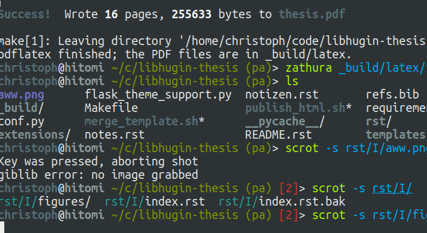

**********
Einleitung
**********

Motivation
==========

The Digitalisierung der modernen Konsumgesellschaft schreitet immer mehr voran.

Wo es vor ein paar Jahren noch üblich war die eigene Filme-Sammlung im Regal
aufzubewahren, wird Sie heute oft nur noch digital auf dem Home Theater PC,
Smart-TV, PC oder anderen Endgeräten digital verwaltet und aufgezeichnet.

Das Aufkommen der digitalen HDTV-Sender und das große Angebot an Pay-TV Sendern
hat dem Trend der letzten Jahre nochmal frischen Auftrieb verpasst. Und hat man
mal einen Spielfilm verpasst, so kann dieser bequem über einen der vielen Online
Videorecorder-Dienste nachträglich bezogen werden.

Es geht sogar soweit, dass bereits USB-Sticks mit Hollywood Spielfilmen verkauft
werden. http://www.amazon.de/Layer-Cake-Film-Flash-Drive/dp/B001Q3LOTQ

Da die Entscheidung über die Filmauswahl i.d.R. über Metadaten wie
Filmbeschreibung, Thema oder Genre statt findet, sind diese ein grundlegender
Bestandteil.

Ziele
=====

Das Ziel ist es ein modulares System zu erschaffen, dass das Spagat zwischen den
verschiedenen Formaten und Metadatenquellen bildet und eine einheitliche API
unabhängig von Metadaten--Quelle und Ausgabe--Format bereitstellt.

.. _test:

hallo

   Hut ab dass das hier so funktioniert. Hätte ich ehrlich gesagt nicht
   gedacht.

Ein anderer Punkt ist der folgende:

Desweiteren soll das System die Möglichkeit bieten, Metadaten *automatisiert* zu
analysieren

Zielgruppe
==========

Alle.
