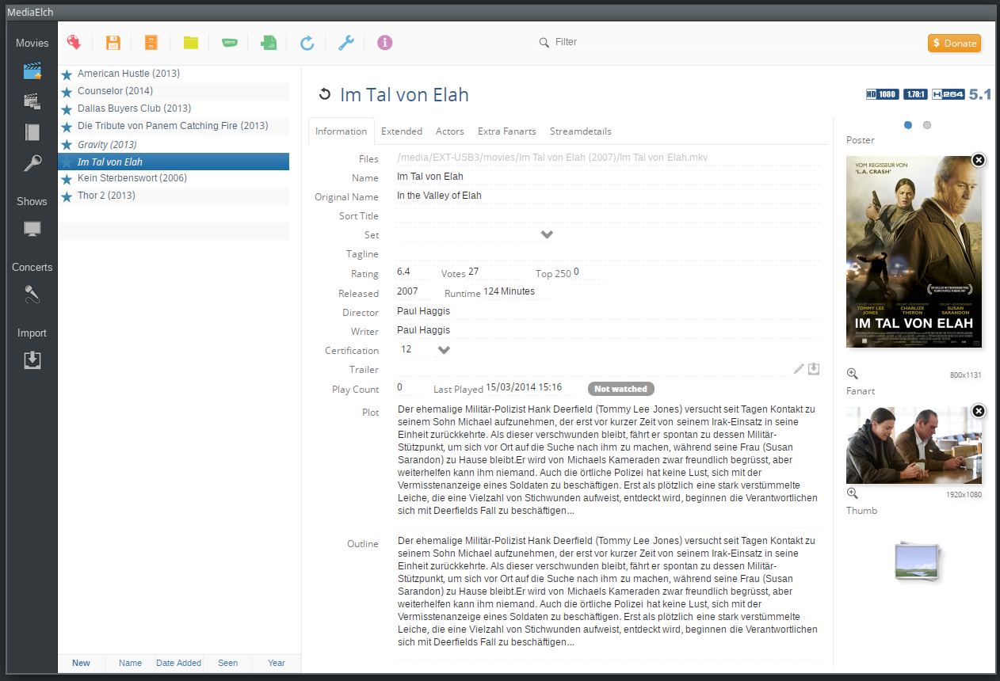

#############################
Metadatenquellen und Software
#############################

Die vorgestellten Plattformen, Player und Tools zeigen nur einen Ausschnitt,
alle bekannten Plattformen, Player und Tools aufzulisten ist aufgrund der
Vielfalt bzw.  Komplexität nicht möglich.

Metadatenarten und Quellen
==========================

Metadatenarten
--------------

Grundsätzlich lassen sich Film--Metadaten in zwei Kategorien
einordnen. Metadaten die das Videoformat (Auflösung, Bitrate, ...) beschreiben
und Metadaten die den Inhalt beschreiben. Metadaten zur Beschreibung des
Videoformat können je nach Container-Format direkt in in die Datei eingebettet
werden (siehe auch :cite:`metadatenarten`).

Inhaltsbezogene Metadaten sind Daten die bei der Digitalisierung nachträglich
gepflegt werden müssen. Typischerweise sind das Attribute wie Titel,
Erscheinungsjahr, Genre, Inhaltsbeschreibung, Cover, u.a.

Metadatenquellen
----------------

**Bezug von Metadaten**

Zum Bezug der Metadaten werden verschiedene Onlinequellen genutzt. Im
Prinzip eignet sich *jede* Seite die Filminformationen pflegt als
Metadatenquelle. Zu den oft genutzten Metadatenquellen --- neben zahlreichen
anderen Quellen --- zählen:

 * Internet Movie Database (IMDb), englischsprachig
 * The Movie Database (TMDb), multilingual, Community gepflegt
 * Online Filmdatenbank (OFDb), deutschsprachig, Community gepflegt

**Unterschiede zwischen den Metadatenquellen**

Alle drei genannten Metadatenquellen unterscheiden sich in Art, Umfang und
Qualität der angebotenen Metadaten.

**IMDb** ist mehr oder weniger der ,,Platzhirsch'' unter den Metadatenquellen. Sie
ist eine Art ,,Quasistandard--Bezugsplattform". Über die bei der IMDb für jeden
Film gepflegte *IMDb--ID* kann ein Film genau identifiziert werden. Da diese
ID eindeutig ist, wird sie oft auch von anderen Onlinequellen mit erfasst
und gepflegt um auch über diese eine Suche zu ermöglichen. Leider bietet IMDb
keine deutschsprachigen Daten an. Auch die grafischen Daten wie Cover und
Hintergrundbilder sind hier, im Vergleich zu anderen Quellen, von niedriger
Qualität.

**TMDb** ist eine hauptsächlich Community gepflegte Datenbank. Die hier gepflegten
Filme enthalten neben den ,,Standard Metadaten'' auch hochauflösende Cover und
Hintergrundbilder (sog. Backdrops, Fanart). Die Datenbank wird oft von Open
Source Projekten wie auch dem Xbox Media Center verwendet.

**OFDb** ist eine im deutschen Raum bekannte Filmdatenbank, welche deutschsprachige
Metadaten pflegt.

Die Metadaten die von den jeweiligen Plattformen bezogen werden unterscheiden
sich stark in ihrer *Qualität*. Insbesondere auch die Inhaltsbeschreibung ist
hier sehr vielfältig -- von kurz und knapp bis sehr ausführlich. Schaut man sich
beispielsweise für den Film ,,Per Anhalter durch die Galaxis (2005)'' die
deutsche Inhaltsbeschreibung auf den vier Film--Plattformen *cinefacts.de*
(siehe :cite:`cinefacts-paddg`), *filmstarts.de* (siehe :cite:`filmstars-paddg`),
*OFDb.de* (siehe :cite:`ofdb-paddg`) und *TMDb* (siehe :cite:`tmdb-paddg`) an, so
wird man feststellen, dass jede dieser Plattformen eine andere deutsche
Inhaltsbeschreibung gepflegt hat.

Je nach persönlichen Präferenzen, möchte man nur eine bestimmte Art von
Inhaltsbeschreibung einpflegen.

Software und Metadatenformate
=============================

Abspielsoftware
---------------

Die Darstellung einer mit Metadaten gepflegten Filmsammlung erfolgt in den
meisten Fällen über sog.  ,,Media Center''--Software, die für den
,,Home--Theater--PC Betrieb" im Wohnzimmer angepasst ist.

Beispiele hierfür wären das Windows Media Center oder auch das freie Xbox Media
Center (Abb. :num:`fig-xbmcscreenshot`, siehe auch :cite:`xbmc`), welches in
letzter Zeit noch einmal durch den Raspberry PI (siehe :cite:`raspberry`)
Bekanntschaft erlangt hat. Neben den PC basierten Lösungen gibt es hier auch
zahlreiche Standalone--Lösungen wie beispielsweise Popcorn Hour (siehe
:cite:`popcornhour`).

.. _fig-xbmcscreenshot:

.. figure:: fig/xbmc-screenshot.png
    :alt: In XBMC gepflegte Filmesammlung
    :width: 90%
    :align: center

    Screenshot einer im Xbox Media Center gefpegten Filmesammlung.

Die Media Center Software kann ihre Metadaten i.d.R. je nach Applikation von
einer oder mehrerer Onlinequellen beziehen. Sie bieten dem Benutzer jedoch
i.d.R. nicht die Möglichkeit Korrekturen durchzuführen und sind somit nur bedingt
zum ,,pflegen" von großen Filmsammlungen geeignet.

Metadata Manager
----------------

Neben den Media Center Lösungen gibt es spezielle Tools für die Pflege und
Korrektur von Film--Metadaten, sog.  *Movie--Metadata--Manager*. Ein
Movie--Management--Tool, welches es unter *unixoden* Betriebssystemen
gibt ist beispielsweise MediaElch (Abb.  :num:`fig-mediaelch`, siehe auch
:cite:`mediaelch`). Hier gibt es unter Linux noch weitere Tools, siehe
:cite:`moviemanager`.

Diese Programme beziehen ihre Metadaten auf die gleiche Art und Weise wie auch
die Media Center Lösungen. Die Management Tools bieten dem Benutzer die
zusätzliche Möglichkeit fehlerhafte Metadaten manuell zu korrigieren und zu
ergänzen.

Da die Programme nur für die Pflege von Metadaten gedacht sind, gibt es hier
immer import/export--Schnittstellen, welche wiederum auf bestimmte Formate
(siehe :ref:`ref-metadatenformate`)
begrenzt sind.

Bestimmte Onlinequellen wie die Internet Movie Database, bieten ihre Metadaten
nur in englischer Sprache an. Möchte man eine deutsche Inhaltsbeschreibung
haben, so muss man auf einen Anbieter zugreifen der diese in deutscher Sprache
pflegt. Je nach Anwendung wird dies aber nicht immer unterstützt.

.. _fig-mediaelch:

    Screenshot Video Management Tool MediaElch.

.. _ref-metadatenformate:

Metadatenformate
----------------

Im Gegensatz zum Musikbereich hat sich bei der Pflege von Metadaten im
Filmbereich kein Standard durchgesetzt.
Hier wird je nach Abspiel- oder Verwaltungssoftware jeweils ein anderes Format
verwendet.

Das Xbox Media Center speichert seine Metadaten beispielsweise intern in einer
Datenbank und schreibt diese beim Exportieren in XML--Dateien [#f0]_, das sog.
nfo-Format raus (siehe :cite:`xbmcnfo`). Nutzt man eine andere Abspielsoftware
wie das Windows Media Center, so werden die Metadaten im dvdxml-Format, auch ein
*XML* basiertes Format, abgespeichert (siehe :cite:`dvdxml`). Hier gibt es noch
zahlreiche andere Formate, auch bei den Movie Managern, auf die nicht
weiter eingegangen wird.

Dieser Umstand erschwert das Pflegen der Film--Metadaten zusätzlich. Für die
beiden genannten Formate, bieten Movie Metadata Manager oft import/export
Möglichkeiten an. Jedoch können andere Player oder auch Standalone Lösungen hier
wiederum ganz andere Formate verwenden, die von der Metadaten--Pflegesoftware
nicht unterstützt wird.

Probleme bei der Metadatenpflege
================================

Metadatenerhebung Grundprobleme
-------------------------------

Unbekannte und ausländische Filme
~~~~~~~~~~~~~~~~~~~~~~~~~~~~~~~~~

In den meisten Fällen werden bei den oben beispielhaft genannten Anwendungen die
richtigen Metadaten für die ,,bekannten" Hollywood Filme gefunden. Hat man aber
eine Filmsammlung die viele *Independent Filme* [#f1]_ oder nicht amerikanische
Verfilmungen enthält, so kommt es immer wieder zu Problemen. Die grundlegenden
Probleme hier sind, dass ein Film entweder gar nicht gefunden wird, nur ein Teil
der Metadaten gefunden wird oder diese eben nur in einer bestimmten Sprache
bezogen werden können.

Werden Metadaten für einen bestimmten Film, über die standardmäßig eingestellte
Onlinequelle nicht gefunden, so gibt es oft die Möglichkeit eine andere
Onlinequelle zu verwenden. Hierbei entstehen oft jedoch neue ,,Probleme", die
nun folgend betrachtet werden.

Datenredundanzen
~~~~~~~~~~~~~~~~

**Grundlegende Problematik**

Redundanzen treten in der Regal auf wenn bei einer Filmsammlung die Daten aus
unterschiedlichen Quellen stammen. Für das Attribut Genre gibt es keine
einheitlich festgelegten Schreibweisen. Neben dem Genre sind auch weitere
Attribute von der Redundanz--Problematik betroffen, jedoch ist das Genre, neben
der Inhaltsbeschreibung, laut Meinung des Autors, eins der wichtigsten
Attribute, da es maßgeblich in die Entscheidung der Filmauswahl einfließt.

**Schreibweise der Genres**

Die Schreibweise der gepflegten Genres unterscheidet sich (siehe
:num:`table-robocop`). Hier ist bei TMDb das Genre ,,Science Fiction'' und bei
OFDb ,,Science-Fiction'' gepflegt.

**Internationalisierung**

Je nach Onlinequelle ist das Genre in einer unterschiedlichen Sprache
gepflegt. IMDb listet hier das Genre ,,Comedy'' (siehe Tabelle
:num:`table-feuchtgebiete`), TMDb die deutsche Bezeichnung ,,Komödie''.

Divergente Daten
~~~~~~~~~~~~~~~~

**Divergente Genres**

Die OFDb--Quelle liefert das Genre ,,Erotik", dieses Genre existiert bei IMDb
(siehe :cite:`imdbgenre`) und bei TMDb :cite:`tmdbgenre` gar nicht.

Beim Bezug von drei Filmen wird deutlich welche *Probleme* bei der Beschaffung
der Metadaten enstehen können. Diese Probleme werden beim *aktuellen Stand der
Technik* durch den Benutzer mühsam manuell gepflegt. Bei kleinen Filmesammlungen
ist der Aufwand der manuellen *nachpflege* noch vertretbar, nicht jedoch bei
*größeren* Sammlungen von mehreren hundert Filmen.

Dateninhomogenität Praxisbeispiel
~~~~~~~~~~~~~~~~~~~~~~~~~~~~~~~~~

Um das Problem zu veranschaulichen, betrachten wir, parallel zur oben genannten
Problematik, Auszüge von Metadaten der drei Onlinequellen IMDb, TMDb und OFDb.

Wir gehen von der Annahme aus, dass die Inhaltsbeschreibung und das
Genre zu den *wichtigsten* Kriterien bei der Filmauswahl gehören und diese somit
*sauber* gepflegt sein müssen und dass wir die folgenden drei Filme in unserer
Filmsammlung mit Metadaten versorgen wollen:

    1) ,,After.Life (2010)'', US-amerikanischer Spielfilm, Agnieszka Wojtowicz-Vosloo
    2) ,,Feuchtgebiete (2013)'', deutsche Romanverfilmung, Charlotte Roche
    3) ,,Nymphomaniac (2013)'', europäisches Drama, Lars von Trier
    4) ,,RoboCop (2014)'', US-amerikanischer Spielfilm, José Padilha

Die Inhaltsbeschreibung ist in der Regel Problemlos austauschbar, jedoch
unterscheidet sie sich auch je nach Quelle in der Formatierung/Art. Nicht alle
Inhaltsbeschreibung haben beispielsweise hinter dem Rollennamen immer den Namen
des Schauspielers in Klammern.

**After.Life (2010)**

.. figtable::
    :label: table-afterlife
    :caption: Übersicht Metadatenquellen für den Film After.Life (2010)
    :alt: Übersicht Metadatenquellen für den Film After.Life (2010)

    +-------+------------------------+----------------------------------+-------------------------+
    |       | IMDb                   | TMDb                             | OFDb                    |
    +=======+========================+==================================+=========================+
    | Plot  | englischsprachig       | deutschsprachig                  | deutschsprachig         |
    +-------+------------------------+----------------------------------+-------------------------+
    | Genre | Drama, Horror, Mystery | Drama, Horror, Mystery, Thriller | Drama, Horror, Thriller |
    +-------+------------------------+----------------------------------+-------------------------+

Die Daten bei TMDb werden in verschiedenen Sprachen gepflegt und sind i.d.R.
*qualitativ hochwertig*. Unser erster Film wurde bei TMDb gut eingepflegt, die
Inhaltsbeschreibung ist deutschsprachig, das Genre feingranular gepflegt. Des
weiteren bietet uns TMDb auch gleich hochauflösende grafische Metadaten. Bei
OFDb ist das Genre ,,Mystery'' nicht gepflegt und zudem gibt es nur ein
niedrigauflösendes Cover und keine Hintergrundbilder (siehe Tabelle
:num:`table-afterlife`).

**Genre:** austauschbar, unterschiedlich ,,feingranular'' gepflegt

**Feuchtgebiete (2013)**

.. figtable::
    :label: table-feuchtgebiete
    :caption: Übersicht Metadatenquellen für den Film Feuchtgebiete (2013)
    :alt: Übersicht Metadatenquellen für den Film Feuchtgebiete (2013)

    +-------+------------------+-----------------+-----------------+
    |       | IMDb             | TMDb            | OFDb            |
    +=======+==================+=================+=================+
    | Plot  | englischsprachig | deutschsprachig | deutschsprachig |
    +-------+------------------+-----------------+-----------------+
    | Genre | Drama, Comedy    | Drama, Komödie  | Erotik          |
    +-------+------------------+-----------------+-----------------+

Unser zweiter Film ist bei TMDb und OFDb gut gepflegt. Was hier jedoch auffällt
ist, dass das gepflegte Genre bei diesen beiden Anbietern keinen Schnittpunkt
hat. Liest man sich zu dem Film den Wikipedia Artikel (siehe
:cite:`feuchtgebiete`) durch, so hat auch das bei OFDb gepflegte Genre seine
Daseinsberechtigung.

**Genre:** total divergent, Problem der Internationalisierung

**Nymphomaniac (2013)**

.. figtable::
    :label: table-nymphomaniac
    :caption: Übersicht Metadatenquellen für den Film Nymphomaniac (2013)
    :alt: Übersicht Metadatenquellen für den Film Nymphomaniac (2013)

    +-------+------------------+------------------+--------------------+
    |       | IMDb             | TMDb             | OFDb               |
    +=======+==================+==================+====================+
    | Plot  | englischsprachig | englischsprachig | deutschsprachig    |
    +-------+------------------+------------------+--------------------+
    | Genre | Drama            | Drama            | Drama, Erotik, Sex |
    +-------+------------------+------------------+--------------------+

Hier ist bei TMDb die Inhaltsbeschreibung in deutsch nicht vorhanden. Der Film
ist im Vergleich zu ,,Hollywood''-Blockbuster in deutsch relativ schlecht
gepflegt. Bei OFDb ist wie auch beim ersten Film, eine deutschsprachige
Inhaltsangabe vorhanden. Zur großen Überraschung ist hier das Genre im Vergleich
zu den beiden anderen Onlinequellen feingranularer gepflegt -- was laut
Wikipedia (siehe :cite:`nymphomaniac`) auch besser zum Film passen würde (siehe
Tabelle :num:`table-nymphomaniac`).

**Genre:** divergent, unterschiedlich ,,feingranular" gepflegt

**RoboCop (2014)**

.. figtable::
    :label: table-robocop
    :caption: Übersicht Metadatenquellen für den Film RoboCop (2014)
    :alt: Übersicht Metadatenquellen für den Film RoboCop (2014)

    +-------+-----------------------+--------------------------------+------------------------------------------+
    |       | IMDb                  | TMDb                           | OFDb                                     |
    +=======+=======================+================================+==========================================+
    | Plot  | englischsprachig      | deutschsprachig                | deutschsprachig                          |
    +-------+-----------------------+--------------------------------+------------------------------------------+
    | Genre | Action, Crime, Sci-Fi | Action, Science Fiction, Krimi | Action, Krimi, Science-Fiction, Thriller |
    +-------+-----------------------+--------------------------------+------------------------------------------+

Der vierte Film, eine Hollywood Remake--Produktion ist hier bei allen drei
Anbietern sehr gut gepflegt (siehe Tabelle :num:`table-robocop`)

**Genre:** unterschiedliche Schreibweise, divergent, Problem der
Internationalisierung, unterschiedlich ,,feingranular" gepflegt

Auswirkungen
~~~~~~~~~~~~

Abspielsoftware wie das XBMC erlaubt es dem Benutzer die Filme nach Genre zu
gruppieren und zu filtern. Durch dieses Feature kann der Benutzer einen Film
nach seinen Vorlieben aussuchen. Durch die Redundanzen ist eine eindeutige
Gruppierung nicht mehr möglich, es herrscht in der Datenbank ein mehr oder
minder chaotischer Zustand.

Probleme bei der Metadatensuche
-------------------------------

Grundlegende Probleme
~~~~~~~~~~~~~~~~~~~~~

**Exakte Suchstrings:** Viele Metadaten-Tools erwarten exakte Suchbegriffe.
Falsch geschriebene Filme wie ,,The Marix" oder ,,Sin Sity'' werden oft nicht
gefunden (siehe Tabelle).

**Suche nach IMDB-ID:** Die Suche nach der IMDb--ID ist bei den getesteten Tools
oft nicht möglich, obwohl diese von manchen Onlineanbietern unterstützt wird
(siehe Tabelle).

Probleme bei Movie Metadata Managern
~~~~~~~~~~~~~~~~~~~~~~~~~~~~~~~~~~~~

Es wurden neben der Abspielsoftware XBMC und dem Movie--Metadaten--Manager
MediaElch, die bereits genannten Movie--Metadaten--Manager (siehe
:cite:`moviemanager`) GCstar, vMovieDB, Griffith und Tellico angeschaut. Die
Resultate hier waren eher ,,ernüchternd'' (siehe Tabelle). Bei den beiden Media
Manager GCstar und vMovieDB hat die Metadatensuche nicht funktioniert, hier
wurde nichts gefunden. Das Verhalten wurde auf zwei Systemen nachgeprüft.  Beim
XBMC wurden die Plugins für die Onlinequellen TMDb und Videobuster angeschaut.
Für die Unschärfesuche wurde nach "Sin Sity" und nach ,,The Marix" gesucht. Die
nicht funktionierenden Movie Manager GCstar und vMovieDB wurde nicht mit
aufgenommen. Das Tool Griffith wurde auch aus der Tabelle genommen, das hier von
den 40 Onlinequellen nur vereinzelt Quellen funktioniert haben. IMDb hat nicht
funktioniert.

.. figtable::
    :label: table-movietools
    :caption: Übersicht Movie Metadaten Manager und Funktionalität
    :alt: Übersicht Movie Metadaten Manager und Funktionalität

    +------------------+------------------------+----------------------------+-------------------------+
    |                  | XBMC                   | MediaElch                  | Tellico                 |
    +==================+========================+============================+=========================+
    | IMDB--ID Suche   | nein                   | nur über IMDb u. TMDb      | nein                    |
    +------------------+------------------------+----------------------------+-------------------------+
    | Unschärfesuche   | nein                   | nein                       | nur IMDb, teilweise     |
    +------------------+------------------------+----------------------------+-------------------------+
    | Onlinequellen    | verschiedene (plugin)  | verschiedene (6)           | wenige (3)              |
    +------------------+------------------------+----------------------------+-------------------------+
    | Metadatenformate | x                      | nur XBMC                   | nein                    |
    +------------------+------------------------+----------------------------+-------------------------+
    | Datenkorrektur   | x                      | ja, manuell                | ja, manuell             |
    +------------------+------------------------+----------------------------+-------------------------+
    | Bemerkungen      | pluginbasierte Scraper | Onlinequellen kombinierbar | x                       |
    +------------------+------------------------+----------------------------+-------------------------+
    | Typ              | Medien Player          | Movie Metadaten Manager    | Movie Metadaten Manager |
    +------------------+------------------------+----------------------------+-------------------------+

Erkentnisse und Anforderungen an das Projekt
============================================

Vielen der genannten Schwierigkeiten lassen sich aufgrund ihrer Natur und dem
aktuellen Kombination aus Abspielsoftware und Movie Manager nicht oder nur mit
manuellen Eingriff durch den Benutzer beheben beheben. Bei *großen*
Filmsammlungen ist dies jedoch mit keinem vernünftigen Aufwand umsetzbar.

Idee
====

Die Idee ist es eine andere Herangehensweise umzusetzen mit dem Ziel die
genannten Probleme abzumildern oder zu beheben.

Es soll *kein neuer* Movie Metadaten Manager entwickelt werden. Die Idee ist
es dem Entwickler bzw. Endbenutzer einen *modularen Werkzeugbaukasten* in Form
einer pluginbasierten Bibliothek über eine einheitliche Schnittstelle bereitzustellen, welcher
an die persönlichen Bedürfnisse anpassbar ist.

Des Weiteren soll die zusätzliche Funktionalität der Datenanalyse,
beispielsweise basierend auf Data-Mining Algorithmen, möglich sein. Das
Hauptaugenmerk des System liegt, im Gegensatz zu den bisherigen Movie Metadaten
Managern, auf der *automatisierten* Verarbeitung großer Datenmengen.

.. rubric:: Footnotes

.. [#f0] Extensible Markup Language (XML), ist eine Auszeichnungssprache zur hierarchisch strukturierten Darstellung von Daten in Textdateien.
.. [#f1] Bezeichnung für Filme, die von Produktionsfirmen finanziert werden,
         welche nicht zu den großen US Studios gehören.
