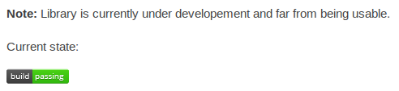
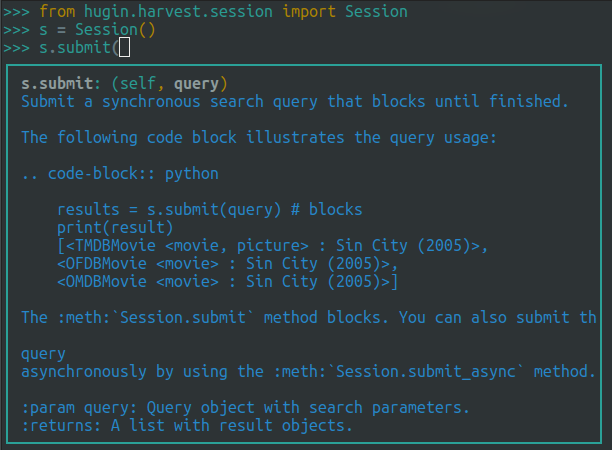

###############
Implementierung
###############

Im Folgenden soll die API und die implementierten Plugins vorgestellt werden.

Libhugin--harvest API
====================

Die API wurde sehr einfach gehalten und ermöglicht dadurch dem Benutzer ein
schnelles Einarbeiten. Folgendes Beispiel, in der interaktiven Python--Shell,
zeigt die typische Benutzung der API:

.. code-block:: python

   >>> from hugin.harvest.session import Session
   >>> session = Session()
   >>> query = session.create_query(title='Prometheus')
   >>> results = session.submit(query)
   >>> print(results)
   [<TMDBMovie <picture, movie> : Prometheus (2012)>,
   <OFDBMovie <movie> :  Prometheus - Dunkle Zeichen (2012)>,
   <OMDBMovie <movie> : Prometheus (2012)>]

Für weitere Beispiele siehe offizielle *libhugin--harvest* API :cite:`huginapi`.

Libhugin--harvest Plugins
=========================

Provider--Plugins
-----------------

Libhugin--harvest hat aktuell verschiedene Provider implementiert, siehe Tabelle
:num:`table-provideroverview`. Ein paar der Provider, wie *Filmstarts.de*,
*Videobuster.de* lassen sich noch weiter ausbauen, diese unterstützen momentan nur
textuelle Metadaten würden sich aber um grafische Metadaten erweitern lassen.

.. figtable::
    :label: table-provideroverview
    :caption: Übersicht implementierter Provider und Funktionalität.
    :alt: Übersicht implementierter Provider und Funktionalität.

    +-----------------------------+--------------------+---------------+----------------+---------------+----------+
    |                             | TMDb               | OFDb          | Videobuster.de | Filmstarts.de | OMDb     |
    +=============================+====================+===============+================+===============+==========+
    | Priorität                   | 90                 | 80            | 70             | 65            | 65       |
    +-----------------------------+--------------------+---------------+----------------+---------------+----------+
    | Providerart                 | movie, person      | movie, person | movie          | movie         | movie    |
    +-----------------------------+--------------------+---------------+----------------+---------------+----------+
    | Metadaten                   | textuell, grafisch | textuell      | textuell       | textuell      | textuell |
    +-----------------------------+--------------------+---------------+----------------+---------------+----------+
    | Sprache                     | multilingual       | deutsch       | deutsch        | deutsch       | englisch |
    +-----------------------------+--------------------+---------------+----------------+---------------+----------+
    | Unschärfesuche Onlinequelle | nein               | nein          | nein           | nein          | nein     |
    +-----------------------------+--------------------+---------------+----------------+---------------+----------+
    | Unschärfesuche libhugin     | ja                 | ja            | ja             | ja            | ja       |
    +-----------------------------+--------------------+---------------+----------------+---------------+----------+
    | IMDB--Suche Onlinequelle    | ja                 | ja            | nein           | nein          | ja       |
    +-----------------------------+--------------------+---------------+----------------+---------------+----------+
    | IMDB--Suche über libhugin   | ja                 | ja            | ja             | ja            | ja       |
    +-----------------------------+--------------------+---------------+----------------+---------------+----------+
    | API verfügbar               | ja                 | ja            | nein           | nein          | ja       |
    +-----------------------------+--------------------+---------------+----------------+---------------+----------+

Postprocessor Plugins
----------------------

Die Postprocessor Plugins beim libgugin harvest Teil sind für die direkte
,,Nachbearbeitung" der Daten gedacht.

**Composer:** Das Composer Plugin ist das momentane Kernstück der Postprocessor
Plugins. Das Plugin gruppiert die Ergebnisse verschiedener Onlinequellen nach
Film und bietet dem Benutzer dadurch folgende Möglichkeiten:

    1) Ergebnis Komponieren
    2) Genre Zusammenführen

**Zu 1.):** Es erlaubt dem Benutzer sich ein nach seinen Wünschen
zusammengesetztes Ergebnis zu komponieren. Der Benutzer kann über das Angeben
eine *Profilmaske* bestimmen wie sich die Metadaten zusammensetzen sollen.
Hier kann er beispielsweise angeben, dass er den Filmtitel, Jahr und Cover vom
Provider *TMDb* möchte, die Inhaltsbeschreibung jedoch immer vom *Filmstarts*
Provider. Hier besteht auch die Möglichkeit eines ,,Fallbacks", falls Filmstarts
keine Inhaltsbeschreibung hat, dann kann auch auf andere Provider
zurückgegriffen werden.

Beispiel für eine Profilmaske, die TMDb als Standardprovider nimmt und die
Inhaltsbeschreibung vom OMDb Provider nimmt, falls OMDb Inhaltsbeschreibung
vorhanden dann erfolgt ein ,,Fallback" auf den OMDb Provider.

.. code-block:: bash

    $ echo "{'default':['tmdbmovie'], 'plot':['ofdbmovie', 'omdbmovie']}" > profilemask

Wird keine Profilmaske angegeben so werden fehlende Attribute nach
Provider--Priorität aufgefüllt.

**Zu 2.):** Dieses Feature erlaubt dem Benutzer divergente Genres
beim gleichen Film zu verschmelzen. Das macht das Genre *feingranularer* und
behebt die Problematik (siehe Tabelle :num:`table-feuchtgebiete` ) divergenter
Genres bei verschiedenen Onlinequellen. Beim Beispiel in Tabelle
:num:`table-feuchtgebiete` wird aus dem normalisierten Genre der drei
unterschiedlichen Anbieter ein Genre erstellt.

.. code-block:: bash

   # Drei Genre der Unterschiedlichen Provider      # Zusammengeführtes Genre
   [Comedy, Drama], [Komödie, Drama], [Erotik] ---> [Komödie, Drama, Erotik]

**ResultTrimmer:** Dies ist vergleichsweise ein einfaches Plugin, welches dafür
zuständig ist vorangehende und nachziehende Leerzeichen bei den Metadaten zu
entfernen. Das Plugin führt eine ,,Bereinigung" durch, diese muss so nicht vom
Provider--Plugin explizit durchgeführt werden.

Converter Plugins
-----------------------

Bei den Converter Plugins wurde zu Demozwecken ein *HTML*--Converter
und ein *JSON*--Converter implementiert.

Des Weiteren wurde für den Produktiveinsatz ein XBMC--Nfo--Converter
implementiert, dieser wird von der Demoanwendung libhugin proxy (siehe
:ref:`libhuginproxy`) verwendet um den XBMC--libhugin Plugin (siehe
:ref:`xbmcplugin`) die Metadaten im richtigen Format zu liefern.

.. _analyzeapiexample:

Libhugin--analyze API
====================

Die API von *libhugin--analyze* ist vom Grundaufbau ähnlich zu der libhugin--harvest
API. Folgendes Beispiel--Snippet zeigt die Anwendung des Plotcleaner--Plugins
auf *Rohdaten*, welche nicht aus der internen Datenbank stammen.

.. code-block:: python

    >>> from hugin.analyze.session import Session
        # Beispieltext. Erstelle Sitzung mit Dummy DB. Hole PlotClean Plugin.
    >>> example_text = "Aus diesem Text wird die Klammer (welche?) samt Inhalt entfernt!"
    >>> session = session('/tmp/temporary.db')
    >>> plotclean = session.modifier_plugins('plotclean')  # hole das PlotClean Plugin
        # Wende Plugin im raw Modus auf Daten an
    >>> result = session.modify_raw(plotclean, 'plot', example_text)
    >>> print(result)
    Aus diesem Text wird die Klammer samt Inhalt entfernt!

Für weitere Informationen siehe libhugin API :cite:`huginapi`. Des Weiteren
zeigt die Demoanwendung Freki den Einsatz von libhugin--analyze, siehe hierzu
:ref:`ref-freki`.

Libhugin--analyze Plugins
========================

Modifier Plugins
----------------

**plotclean:** Das *PlotClean* Plugin ist für nachträgliche Manipulation der
Inhaltsbeschreibung gedacht. Im Fall vom PlotClean Plugin werden alle Klammern
samt Inhalt aus der Beschreibung entfernt. Das vereinheitlicht die
Inhaltsbeschreibung in dem Sinne, dass alle Schauspieler oder Informationen in
Klammern aus der Beschreibung entfernt werden. Für ein Beispiel siehe
:ref:`analyzeapiexample`.

**plotchange:** Das *PlotChange* Plugin ist für das nachträgliche Ändern der
Inhaltsbeschreibung zuständig. Im Moment hat es die Option die Sprache des Plots
zu ändern, für ein Beispiel siehe Demoanwendung :ref:`ref-plotchange-freki`.

Analyzer Plugins
----------------

**keywordextractor:** Dieses Plugin extrahiert aus einem Text, bei Filmen meist
die Inhaltsbeschreibung, relevante Schlüsselwörter, die den Text beziehungsweise
die Thematik repräsentieren.

Weiteres hierzu in der Bachelorarbeit.

**filetypeanalyzer:** Das Filetypeanalyzer--Plugin arbeitet mit den Videodaten
selbst. Er ist für die Extraktion der Datei--Metadaten zuständig. Momentan
extrahiert es:

    * Auflösung
    * Seitenverhältnis
    * Videocodec
    * Audiocodec, Anzahl der Audiokanäle, Sprache

**plotlang:** Der Plotlang--Analyzer erkennt die Sprache des verwendeten Plots
und schreibt die Information zu den Analysedaten. Für ein Beispiel siehe
Demoanwendung :ref:`ref-plotlang-freki`.

Comperator Plugins
------------------

Dieser Plugintyp ist experimentell, er ist für statistische Zwecke und
Analysen bezüglich der Vergleichbarkeit von Filmen anhand der Metadaten gedacht.
Weiteres hierzu wird in der Bachelorarbeit behandelt.

Folgende Comperator Plugins wurden konzeptuell implementiert:

**genrecmp:** Ein Plugin, das die Genres verschiedener Filme miteinander
vergleicht.

**keywordcmp:** Ein Plugin, das die Schlüsselwörter verschiedener Filme
miteinander vergleicht.

Verschiedenes
=============

Testverfahren
-------------

Für das Testen der Software wird das Python Unittest--Framework verwendet.
Bisher wurden Tests für die wichtigsten Grundklassen und das
Provider--Pluginsystem erstellt, um ein valides Verhalten der Provider--Plugins
zu gewährleisten.

Die Unittests wurden direkt in der ,,Main" der jeweiligen Klasse untergebracht.
Diese werden dann beim Ausführen der Python--Datei gestartet.

Folgendes Beispiel zeigt die Funktionsweise:

.. code-block:: python

   def add(a, b): return a + b

   if __name__ == '__main__':
       import unittest

       class SimpleTest(unittest.TestCase):
           def test_add_func(self):
               result = add(21, 21)
               self.assertTrue(result == 42)

       unittest.main()

Das Ausführen des Beispielcodes würde folgende Ausgabe produzieren:

.. code-block:: bash

    ----------------------------------------------------------------------
    Ran 1 test in 0.000s

    OK

Alle geschrieben Tests werden bei jedem ,,Einspielen" der Änderungen in das
verwendete Quellcode--Versionsverwaltungssystem (siehe :ref:`github`)
automatisiert über einen externen Dienst ausgeführt (siehe :ref:`travisci`).

Entwicklungumgebung
-------------------

Programmiersprache
~~~~~~~~~~~~~~~~~~

Für die Entwicklung der Bibliothek wurde die Programmiersprache Python, in der
Version 3.3, aus folgenden Gründen gewählt:

    * **Rapid Prototyping Language:**, wichtig bei einem Projekt dieser Größe mit
      begrenztem Zeitraum (vgl. :cite:`lutz2013learning`).
    * **Plattformunabhängigkeit:**, Plattformunabhängigkeit ist ein sekundäres
      Ziel des Projekts.
    * **Einfach erlernbar:**, Wichtig für Pluginentwickler.
    * **Verbreitungsgrad:**, Gängige Skriptsprache bei vielen Open Source Projekten
    * **Optimierungsmöglichkeiten:**, Kompilirung von Pytnon mittels Cython
      (siehe :cite:`cython`, vgl. :cite:`lutz2013learning`)

Entwicklungssytem
~~~~~~~~~~~~~~~~~

Die Bibliothek wird unter *Archlinux* entwickelt. Für die Entwicklung wird der
Editor *gVim* mit entsprechenden Python--Plugins zur Validierung der Python PEP
Stilrichtlinien (siehe :cite:`pep`) verwendet. Des Weiteren wird die interaktive
Python Shell *IPython* eingesetzt.

Quellcodeverwaltung
~~~~~~~~~~~~~~~~~~~

Für die Quellcodeverwaltung wird das Versionsverwaltungssystem *git*
eingesetzt. Der Quellcode selbst wird auf dem Hosting--Dienst für
Software--Entwicklungsprojekte *GitHub* (siehe :cite:`github`) gelagert.

Automatisches Testen
~~~~~~~~~~~~~~~~~~~~

Die oben genannten Softwaretests werden von *TravisCI* (siehe :cite:`travisci`),
einem sogenanntem ,,Continuous Integration Service" automatisch ausgeführt. Dies
passiert bei jedem Hochladen von Quellcodeänderungen auf GitHub. GitHub hat hier
einen Service--Schnittstelle zu TravisCI, welche aktiviert wurde.

Ein Logo (siehe Abbildung: :num:`fig-build`) auf der libhugin
Github--Projektseite teil so dem Besuchern der Seite den aktuellen
,,Projektstatus" mit.

.. _fig-build:

    Logo das den aktuellen ,,Build--Status" der GitHub--Projektseite.

Projektdokumentation
~~~~~~~~~~~~~~~~~~~~

Das Projekt wird nach den Regeln der *literalen Programmierung*, wie nach
*Donald E. Knuth* (siehe :cite:`knuth`) empfohlen, entwickelt. Hierbei liegen
Quelltext und Dokumentation des Programms in der gleichen Datei.

Die Dokumentation kann so über spezielle Softwaredokumentationswerkzeuge
generiert werden. Unter Python wird hier das Softwaredokumentationswerkzeug
*Sphinx* (siehe :cite:`sphinxdoc`) verwendet. Dieses kann eine Dokumentation in
verschiedenen Formaten generieren, auch diese Projektarbeit wurde in
*reStructuredText* (siehe :cite:`rst`) geschrieben und mit *Sphinx* generiert.

Des Weiteren wird dem Entwickler bei Nutzung der Bibliothek in der interaktiven
Python--Shell eine zusätzliche Hilfestellung geboten (siehe :num:`fig-knuth`).

.. _fig-knuth:

    API--Dokumentation als Hilfestellung in der interaktiven Python--Shell bpython.

|
|
|

Externe Bibliotheken
--------------------

Die Tabelle :num:`table-libs` listet alle momentan verwendeten externen
Abhängigkeiten für die Libhugin--Bibliothek.

.. figtable::
    :label: table-libs
    :caption: Übersicht externe Abhängigkeiten
    :alt: Übersicht externe Abhängigkeiten

    +-----------------------+----------------+---------------------------------+
    | Abhängigkeit          | Verwendung in  | Einsatzzweck                    |
    +=======================+================+=================================+
    | yapsy                 | Pluginsystem   | Laden von Plugins               |
    +-----------------------+----------------+---------------------------------+
    | charade               | Downloadqueue  | Encodingerkennung               |
    +-----------------------+----------------+---------------------------------+
    | parse                 | Plugins        | Parsen von Zeitstrings          |
    +-----------------------+----------------+---------------------------------+
    | httplib2              | Downloadqueue  | Content download                |
    +-----------------------+----------------+---------------------------------+
    | jinja2                | Plugins        | HTML Template Engine            |
    +-----------------------+----------------+---------------------------------+
    | docopt                | Cli--Tools     | CLI--Optionparser               |
    +-----------------------+----------------+---------------------------------+
    | Flask                 | Huginproxy     | Webframework, RESTful interface |
    +-----------------------+----------------+---------------------------------+
    | guess_language-spirit | Plugins        | Spracherkennung                 |
    +-----------------------+----------------+---------------------------------+
    | PyStemmer             | Plugins        | Stemming von Wörtern            |
    +-----------------------+----------------+---------------------------------+
    | pyxDamerauLevenshtein | Plugins, Utils | Vergleich von Strings           |
    +-----------------------+----------------+---------------------------------+
    | Pyaml                 | Plugins        | Verarbeitung von Yaml Dateien   |
    +-----------------------+----------------+---------------------------------+
    | beaufifulsoup4        | Plugins        | Parsen von HTML Seiten          |
    +-----------------------+----------------+---------------------------------+
    | xmltodict             | Plugins        | Verarbeitung von XML Dokumenten |
    +-----------------------+----------------+---------------------------------+

Projektumfang
-------------

Der Projektumfang beträgt ca. 3500 *lines of code*,  hier kommt noch zusätzlich
die Onlinedokumentation hinzu.

.. code-block:: bash

    $ cloc hugin/ tools/
         119 text files.
         117 unique files.
          87 files ignored.

    http://cloc.sourceforge.net v 1.60  T=0.51 s (109.5 files/s, 11970.3 lines/s)
    -------------------------------------------------------------------------------
    Language                     files          blank        comment           code
    -------------------------------------------------------------------------------
    Python                          49           1220           1171           3540
    XML                              5              1              0             57
    HTML                             2              9            113             10
    -------------------------------------------------------------------------------
    SUM:                            56           1230           1284           3607
    -------------------------------------------------------------------------------
