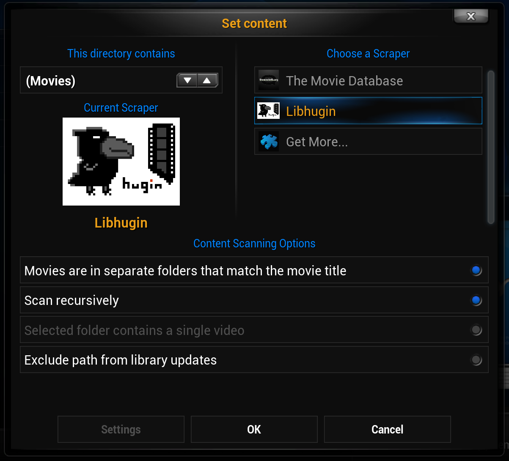

###############
Demoanwendungen
###############

Die vorgestellten CLI--Tools stellen nur einen kleinen Ausschnitt der
Fähigkeiten der Bibliothek dar, die Bibliothek selbst ist um fast jede denkbare
Funktionalität der Metadatenaufbereitung erweiterbar.

Der *libhugin--harvest* CLI--Tool Geri
======================================

Geri ist eine CLI--Anwendung die zu Demozwecken, aber auch als Testwerkzeug für
die *libhugin--harvest* Bibliothek verwendet werden kann.

Übersicht der Optionen
----------------------

Ein Überblick über die Funktionalität und die möglichen Optionen zeigt die Hilfe
des Tools:

::

   $ geri -h
   Libhugin commandline tool.

   Usage:
     geri (-t <title>) [-y <year>] [-a <amount>] [-p <providers>...] [-c <converter>] \
          [-o <path>] [-l <lang>] [-P <pm>]  [-r <processor>] [-f <pfile>] [-L]
     geri (-i <imdbid>) [-p <providers>...] [-c <converter>] [-o <path>] [-l <lang>] \
          [-r <processor>] [-f <pfile>] [-L]
     geri (-n <name>) [--items <num>] [-p <providers>...] [-c <converter>] [-o <path>]
     geri list-provider
     geri list-converter
     geri list-postprocessor
     geri -h | --help
     geri --version

    Options:
      -t, --title=<title>               Movie title.
      -y, --year=<year>                 Year of movie release date.
      -n, --name=<name>                 Person name.
      -i, --imdbid=<imdbid>             A imdbid prefixed with tt.
      -p, --providers=<providers>       Providers to be used.
      -c, --convert=<converter>         Converter to be used.
      -r, --postprocess=<processor>     Postprocessor to be used.
      -o, --output=<path>               Output folder for converter result [default: /tmp].
      -a, --amount=<amount>             Amount of items to retrieve.
      -l, --language=<lang>             Language in ISO 639-1 [default: de]
      -P, --predator-mode               The magic 'fuzzy search' mode.
      -L, --lookup-mode                 Does a title -> imdbid lookup.
      -f, --profile-file=<pfile>        User specified profile.
      -v, --version                     Show version.
      -h, --help                        Show this screen.

Das Tool eignet sich neben dem Einsatz als Testwerkzeug für die Bibliothek
auch gut für Skripte und somit für automatische Verarbeitung *großer*
Datenmengen, siehe auch *Scripting Tasks* :ref:`ref-scripting-tasks`.

Filmsuche
---------

Ein Film kann über den Titel oder über die *IMDB ID* gesucht werden. Hier gibt
es die Möglichkeit *Geri* auch bestimmte Provider, Converter, Sprache und
Postprocessor Plugins anzugeben.

Um das Ausgabeformat zu konfigurieren gibt es im *Geri*--Ordner eine
``movie.mask``-- und ``person.mask``--Datei. Über diese Dateien kann das
Ausgabeformat definiert werden. Die Syntax ist einfach. Um Attribute
darzustellen, werden diese einfach in geschweifte Klammern geschrieben. Das
*num*--Attribut gibt Geri noch die Möglichkeit die Resultate durchzunummerieren.

**Definition des Ausgabeformats für Filme**

Folgend die Definition vom Ausgabeformat für die ``movie.mask``:

.. code-block:: bash

   echo "{num}) {title} ({year}), IMDBid: {imdbid} Provider: {provider}\
   \nInhalt: {plot}" > tools/geri/movie.mask

**Filmsuche**

Standardsuche nach Titel mit der Begrenzung auf fünf Ergebnisse:

.. code-block:: bash

   $ geri --title "sin city" --amount=5
   1) Sin City (2005), IMDBid: tt0401792, Provider: TMDBMovie <picture, movie>
   Inhalt: Basin City, genannt Sin City, ist ein düsteres Metropolis, in dem nichts
   und niemand wirklich sicher ist, in dem die Gewalt allgegenwärtig ist [...]

   2) Sin City (2005), IMDBid: tt0401792, Provider: OFDBMovie <movie>
   Inhalt: Basin City, genannt Sin City, ist ein düsteres Metropolis, in dem nichts
   und niemand wirklich sicher ist, in dem die Gewalt allgegenwärtig ist [...]

   3) Sin City (2005), IMDBid: None, Provider: VIDEOBUSTERMovie <movie>
   Inhalt: Willkommen in Sin City.  Diese Stadt begrüßt die Harten, die Korrupten,
   die mit den gebrochenen Herzen.  Einer von ihnen ist Marv [...]

   4) Sin City (2005), IMDBid: tt0401792, Provider: OMDBMovie <movie>
   Inhalt: Four tales of crime adapted from Frank Miller's popular comics focusing
   around a muscular brute who's looking for the person responsible for the [...]

   5) Sin City (2005), IMDBid: None, Provider: FILMSTARSMovie <movie>
   Inhalt: "Sin City" enthält drei lose verbundene und ineinander verschachtelt
   erzählte Episoden: Los geht es mit Hartigan (Bruce Willis) - einem Cop [...]

Die Suche kann wie die Optionen zeigen *feingranularer* konfiguriert werden.
Es würde jedoch den Rahmen sprengen würde alle Optionen zu zeigen.

**Unschärfesuche**

Ein weiteres nennenswertes Feature ist die Unschärfesuche.  Die getesteten Tools
(siehe Tabelle :num:`table-movietools`) sind nicht in der Lage Filme zu
finden wenn der Titel nicht exakt geschrieben ist. Das trifft auch in der
Standardkonfiguration für *libhugin* zu, weil hier die Onlinequellen, auf die
zugegriffen wird, exakte Suchbegriffe erwarten.

.. code-block:: bash

   # Findet keine Ergebnisse, weil hier ,,Matrix" falsch geschrieben ist
   $ geri --title "the marix" --amount=2

Mit dem aktivierten *Predator-Mode* findet *Geri* providerübergreifend den
gesuchten Film.

.. code-block:: bash

   $ geri --title "the marix" --amount=2
   1) Matrix (1999), IMDBid: tt0133093, Provider: TMDBMovie <movie, picture>
   Inhalt: Der Hacker Neo wird übers Internet von einer geheimnisvollen Untergrund-
   Organisation kontaktiert.  Der Kopf der Gruppe - der gesuchte Terrorist [...]

   2) Matrix (1999), IMDBid: tt0133093, Provider: OFDBMovie <movie>
   Inhalt: Was ist die Matrix?  Diese Frage quält den Hacker Neo seit Jahren.  Er
   führt ein Doppelleben - tagsüber ist er Thomas Anderson und arbeitet in [...]

**Suche über IMDB ID**

Normalerweise kann nur über die *IMDB ID* gesucht werden wenn es die jeweilige
Onlinequelle unterstützt. Deswegen funktioniert standardmäßig die Suche bei
Providern wie *Filmstarts* oder *Videobuster* nicht (siehe
:num:`table-movietools`).  *Libhugin* schafft hier Abhilfe mit einer
providerübergreifenden *IMDB ID*--Suche.

Im folgenden Beispiel findet der Provider *videobustermovie* keine Ergebnisse,
weil die Onlinequelle die Suche über IMDB ID nicht unterstützt:

.. code-block:: bash

   $geri --imdbid "tt0133093" -p videobustermovie

Mit dem *Lookup-Mode* funktioniert auch die Suche über IMDB ID bei
Onlinequellen, die eine Suche über die *IMDB ID* nicht unterstützen:

.. code-block:: bash

   $geri --imdbid "tt0133093" -p videobustermovie --lookup-mode
   1) Matrix (1999), IMDBid: None, Provider: VIDEOBUSTERMovie <movie>

   Inhalt: Der Hacker Neo (Keanu Reeves) wird übers Internet von einer
   geheimnisvollen Untergrund-Organisation kontaktiert.  Der Kopf der [...]

   [...]

Einsatz von Plugins
-------------------

**Einsatz von Postprocessor--Plugins**

Ein noch nennenswertes Feature ist der Einsatz vom Composer Plugin. Dies
ermöglicht dem Benutzer das Ergebnis nach seinen Bedürfnissen zu komponieren und
besitzt die Fähigkeit das normalisierte Genre mehrerer Provider
zusammenzuführen.

Zuerst wird die *movie.mask* angepasst, damit das Genre und das normalisierte
Genre zu sehen ist:

.. code-block:: bash

   echo "{num}) {title} ({year}), IMDBid: {imdbid}, Provider: {provider}\
   \nGenre: {genre}\nGenre normalisiert: {genre_norm} \nInhalt: {plot}" > movie.mask

Des Weiteren wird ein benutzerdefiniertes *userprofile* erstellt, welches dem
*Composer*--Plugin mitteilt wie das Ergebnis zusammengebaut werden soll. In
unserem Beispiel wird ein Profil erstellt welches standardmäßig den TMDb
Provider nimmt und die Inhaltsbeschreibung durch die vom OFDb Provider
austauscht.

.. code-block:: bash

   echo "{'default':['tmdbmovie'], 'plot':['ofdbmovie']}" > userprofile

Suche nach dem Film *,,Feuchgebiete (2013)"* mit Einsatz vom *Composer*--Plugin
und Beschränkung auf die zwei Provider TMDb und OFDb:

.. code-block:: bash

   geri --title "feuchtgebiete" -r composer -f userprofile -ptmdbmovie,ofdbmovie -a2
   1) Feuchtgebiete (2013), IMDBid: tt2524674, Provider: TMDBMovie <movie, picture>
   Genre: ['Komödie', 'Drama']
   Genre normalisiert: ['Komödie', 'Drama']
   Inhalt: Helen ist eine Herausforderung für ihre Mutter und ihren Vater, die
   getrennt leben und geschieden sind.  Trotzdem wünscht sich Helen nichts [...]

   2) Feuchtgebiete (2013), IMDBid: tt2524674, Provider: OFDBMovie <movie>
   Genre: ['Erotik']
   Genre normalisiert: ['Erotik']
   Inhalt: Die 18jährige Helen (Carla Juri) hat schon seit ihrer Kindheit
   Hämorrhoiden, hat diesen Fakt aber immer verheimlicht, da sie glaubte [...]

   3) Feuchtgebiete (2013), IMDBid: tt2524674, Provider: Composer
   Genre: ['Komödie', 'Drama']
   Genre normalisiert: {'Erotik', 'Drama', 'Komödie'}
   Inhalt: Die 18jährige Helen (Carla Juri) hat schon seit ihrer Kindheit
   Hämorrhoiden, hat diesen Fakt aber immer verheimlicht, da sie glaubte [...]

Das dritte Resultat in der Ausgabe wurde vom Provider ,,Composer" generiert,
das ist das komponierte Ergebnis.  Des Weiteren wurde hier das normalisierte
Genre verschmolzen. Dieses Feature macht das gepflegte Genre in unseren
Metadaten *feingranularer* und lässt im Beispiel auch besser vermuten ob ein
Film für Kinder geeignet ist oder nicht.

.. _ref-freki:

Der *libhugin--analyze* CLI--Tool Freki
=======================================

Freki ist für Demonstrationszwecke und das Testen der libhugin--analyze
Bibliothek entwickelt worden.

Übersicht der Optionen
----------------------

Folgend zum Überblick der Funktionalität die Hilfe des Tools Freki:

.. code-block:: bash

   $python freki -h
   Libhugin--analyzer commandline testtool.

   Usage:
     freki create <database> <datapath>
     freki list <database>
     freki list <database> attr <attr>
     freki list <database> analyzerdata
     freki list-modifier | list-analyzer
     freki (analyze | modify) plugin <plugin> <database>
     freki (analyze | modify) plugin <plugin> pluginattrs <pluginattrs> <database>
     freki export <database>
     freki -h | --help
     freki --version

   Options:
     -v, --version                     Show version.
     -h, --help                        Show this screen.

Erstellen einer Datenbank
-------------------------

Freki erlaubt dem Benutzer eine *Datenbank* aus externen Metadaten zu
generieren. Auf dieser Datenbank kann man folgend mit den Analyzer--, Modifier--
und Composer--Plugins, die *libhugin* anbietet, arbeiten um beispielsweise seine
Metadaten zu säubern. Nach der Bearbeitung können die *neuen* Metadaten in die
externen Metadaten--Dateien exportiert werden.

Folgend eine kurze Demonstration des CLI--Tools.

**Erstellen einer Datenbank**

Hierzu wird die Helferfunktion (siehe Anhang :ref:`ref-attachment-a`) verwendet.
Im Ordner *movies* befinden sich zwei Filme die mit dem XBMC mit Metadaten
versorgt wurden.

.. code-block:: bash

    $ freki create mydb.db ./movies

**Datenbank anzeigen**

Mit *list* kann der Inhalt der Datenbank angezeigt werden. Die
Inhaltsbeschreibung wurde hier wegen der Übersichtlichkeit gekürzt.  Wie die
Ausgabe zeigt wurden die Attribute *title*, *originaltitle*, *genre*,
*director*, *year* und *plot* eingelesen.

.. code-block:: bash

    $ freki list mydb.db
    0) All Good Things (2010)
    {'director': 'Andrew Jarecki',
     'genre': ['Drama', 'Mystery', 'Suspense', 'Thriller'],
     'originaltitle': 'All Good Things',
     'plot': 'Historia ambientada en los años 80 y centrada en un heredero de
     una dinastía de Nueva York que se enamora de una chica de otra clase
     [..]',
     'title': 'All Beauty Must Die',
     'year': '2010'}

    1) Alien³ (1992)
    {'director': 'David Fincher',
     'genre': ['Action', 'Horror', 'Science Fiction'],
     'originaltitle': 'Alien³',
     'plot': 'Después de huir con Newt y Bishop del planeta Alien, Ripley se
     estrella con su nave en Fiorina 161, un planeta prisión. Desgraciadamente
     [...]',
     'title': 'Alien 3',
     'year': '1992'}

**Analyzer--Data anzeigen**

Auflisten der Analysedaten aller sich in der Datenbank befindlichen Filme:

.. code-block:: bash

    $ freki list mydb.db analyzerdata
    0) All Good Things (2010)
    {}
    1) Alien³ (1992)
    {}

Da noch nichts weiter analysiert wurde, sieht man hier nur *leere* Klammern.

**Analyzer und Modifier anzeigen**

Anzeigen der vorhandenen Analyzer:

.. code-block:: bash

    $ freki list-analyzer
    Name:           MovieFileAnalyzer
    Description:    Analayze movie files, extract video or audio information.
    Parameters:     {}

    Name:           PlotLang
    Description:    Analyzes the language of a given plot.
    Parameters:     {'attr_name': <class 'str'>}

Anzeigen der vorhandenen Modifier:

.. code-block:: bash

    $ freki list-modifier
    Name:           PlotChange
    Description:    Allows to exchange plot to given language.
    Parameters:     {'attr_name': <class 'str'>, 'change_to': <class 'str'>}

    Name:           PlotCleaner
    Description:    Removes brackets e.g. brakets with actor name from plot.
    Parameters:     {'attr_name': <class 'str'>}

Einsatz von Plugins
-------------------

**Anwenden von Analyzern**

Anwendung des *plotlang* Plugins auf der *mydb.db* Datenbank:

.. code-block:: bash

    $freki analyze plugin plotlang mydb.db

Betrachten der Analyzerdaten nach der Analyse:

.. code-block:: bash
    $ freki list mydb.db analyzerdata
    0) All Good Things (2010)
    {'PlotLang': 'es'}
    1) Alien³ (1992)
    {'PlotLang': 'es'}

Wie man sieht, wurde hier die verwendete Sprache der Plots analysiert. Das
Plugin hat sich in das Analysedaten--Array mit seinem ermittelten Ergebnis
eingetragen. In unserem Beispiel *es (espanol)* für eine spanische
Inhaltsbeschreibung.

**Anwenden von Modifiern**

Anwendung des PlotChange Modifier--Plugins um die Sprache Inhaltsbeschreibung
von spanisch auf deutsch zu ändern:

.. code-block:: bash

    $ freki modify plugin plotchange pluginattrs attr_name='plot',change_to=de mydb.db

Betrachten der Metadaten nach Einsatz des Plugins:

.. code-block:: bash
    $ freki list mydb.db
    0) All Good Things (2010)
    {'director': 'Andrew Jarecki',
     'genre': ['Drama', 'Mystery', 'Suspense', 'Thriller'],
     'originaltitle': 'All Good Things',
     'plot': 'David Marks, Sohn einer reichen New Yorker Familie, verliebt sich
     in die junge Katie McCarthy, die nicht zu seinen Kreisen gehört. Doch dann [...]',
     'title': 'All Beauty Must Die',
     'year': '2010'}

    1) Alien³ (1992)
    {'director': 'David Fincher',
     'genre': ['Action', 'Horror', 'Science Fiction'],
     'originaltitle': 'Alien³',
     'plot': 'Nachdem Ellen Ripley, die kleine Newt, Soldat Hicks und der
     Android Bishop von LV 426 entkommen sind und sich mit dem Raumschiff USS [...]','
     'title': 'Alien 3',
     'year': '1992'}

Wie in dem Beispiel zu sehen ist wurde die Inhaltsbeschreibung bei den Filmen
von der spanischen Version auf eine deutsche Version geändert.

Exportieren der Daten
---------------------

Die modifizierten Metadaten können nun ins Produktivsystem zurück gespielt
werden.  Dies geht bei Freki über die *export* Funktion, hier wird wieder im
Hintergrund die Helferfunktion (siehe Anhang :ref:`ref-attachment-a`) verwendet.

Betrachten der der Inhaltsbeschreibung der *Nfo*--Dateien vor dem export
(gekürzt):

.. code-block:: bash

    $ cat "movies/All Good Things (2010)/movie.nfo" | grep plot
    <plot>Historia ambientada en los años 80 y centrada en un heredero de una
    dinastía de Nueva York que se enamora de una chica de otra clase social. [...]</plot>

Export der modifizierten Datenbank:

.. code-block:: bash

    $ freki export mydb.db
    ./movies/All Good Things (2010)/movie.nfo
    ./movies/Alien³ (1992)/movie.nfo

Betrachten der Inhaltsbeschreibung der *nfo*-Dateien nach dem export (gekürzt):

.. code-block:: bash
    $ cat "movies/All Good Things (2010)/movie.nfo" | grep plot
    <plot>David Marks, Sohn einer reichen New Yorker Familie, verliebt sich in
    die junge Katie McCarthy, die nicht zu seinen Kreisen gehört. [...]</plot>

Betrachtet man nun die nfo--Dateien der jeweiligen Filme, so sieht man, dass
sich hier die Sprache von spanisch auf deutsch geändert hat.

XBMC Plugin Integration
=======================

.. _xbmcplugin:

XBMC Plugin
-----------

Neben den Kommandozeilentools Geri und Freki wurde *konzeptuell* ein Plugin für
das XBMC (siehe Abb.: :num:`fig-xbmcscreenshot-hugin`) geschrieben,
welches *libhugin* als Metadatenquelle nutzen kann.

Das XBMC erlaubt es sogenannte :term:`Scraper` zu schreiben.
Diese arbeiten vom Grundprinzip ähnlich wie die Provider von *libhugin*. Das
Problem bei dessen Scrapern ist, dass diese vollständig mittels Regulärer
Ausdrücke innerhalb von *XML*--Dateien geschrieben sind. Dies ist nach Meinung
des Autors fehleranfällig, aufwändig und nur schwer lesbar. Des Weiteren sind
hier die Möglichkeiten des Postprocessings nur begrenzt umsetzbar.

Die Referenzimplementierung des offiziellen TMDb--Scrapers hat insgesamt über 600
*lines of code*, recht kryptischer regulärer Ausdrücke (siehe
:cite:`tmdbscraper1` und :cite:`tmdbscraper2`).
Die Implementierung des *libhugin* Plugins in das XBMC hat an dieser Stelle nur
23 *lines of code* (siehe :ref:`ref-xbmc-libhugin`). Das liegt daran, dass der
libhugin Proxy hier dem XBMC die Daten bereits im benötigten Format über das
*Nfo*--Converter--Plugin liefern kann.

.. _fig-xbmcscreenshot-hugin:

    Libhugin Scraper Plugin im XBMC Scraper Menü.

.. _libhuginproxy:

libhugin--Proxy
---------------

Da die direkte Integration in das XBMC aufgrund der begrenzten Zeit der
Projektarbeit nicht möglich ist, wurde hier der Ansatz eines ,,Proxy--Dienstes"
angewandt. Für Libhugin wurde mittels dem Microwebframework Flask (siehe
:cite:`flask`) ein *minimaler* :term:`RESTful` Webservice geschrieben (siehe
:ref:`ref-flaskproxy`), welcher über eine eigens definierte API Metadaten an das
XBMC liefert.

**Libhugin RESTful API**

Der *Libhugin*--Proxy zeigt *konzeptuell* die Integration von libhugin als
Netzwerkdienst, welcher eine RESTful API bereitstellt. Nach dem der
*libhugin*--Proxy gestartet wurde, ist es möglich über den Webbrwoser auf die
RESTful API über Port 5000 zuzugreifen.

Folgende URL würde eine Suche nach dem Film *,,Only God Fogrives (2013)"*
starten:

::

    http://localhost:5000/search/Only+god+forgives

Die implementierte Test--API bietet die folgenden Schnittstellen:

    + ``/search/<titlename or imdbid>:`` Suche nach Film über Titel oder *IMDB ID*.
    + ``/movie/<position>:`` Zugriff auf einen bestimmten Film im Proxy Cache.
    + ``/stats:`` Server Information, welche zeigt ob Postprocessing aktiviert ist.
    + ``/toggle_pp:`` Postprocessing aktivieren oder deaktivieren.
    + ``/shutdown:`` Server herunterfahren.

Die Implementierung des Proxy zeigt, dass es mit relativ wenig Aufwand möglich
ist, libhugin als ,,neuen Dienst" für Multimedia--Anwendungen oder auch Movie
Metadaten Manager zu verwenden.

Hierbei kommt die Flexibilität und Anpassbarkeit des Systems den bisherigen
Tools zu Gute. Auf diese Art und Weise lassen sich alle Features die *libhugin*
bietet in bereits existierende Tools integrieren.

Unterschiede TMDb XBMC und TMDb libhugin
----------------------------------------

Im Vergleich zum XBMC TMDb--Scraper bietet der libhugin XBMC Scraper (Provider
zum Testen auch auf nur TMDb konfiguriert) zusätzliche Features.

    * Suche über *IMDB ID* möglich.
    * Unschärfesuche möglich, dadurch auch erhöhte Trefferquote.
    * Postprocessing, je nach dazugeschalteten Plugin möglich.

Beim Nutzen weiterer Provider sowie Plugins, wie dem Composer Plugin eröffnen
sich hier für das XBMC ganz neue Möglichkeiten seine Metadaten nach den eigenen
Wünschen zusammen zu bauen, ohne dabei auf externe Movie--Manager zugreifen zu
müssen. Im Prinzip kann libhugin hier das komplette Metadatensystem vom XBMC
ersetzen.

.. _ref-scripting-tasks:

Weitere Einsatzmöglichkeiten
============================

**Scripting Tasks:** Die Einsatzmöglichkeiten sind je nach Szenario anpassbar.
Für einfache Anwendungen lassen sich Geri und Freki bereits direkt verwenden.

Ein schönes Beispiel für einen Scripting--Task ist das Normalisieren der
Ordnerstruktur/Benennung von großen Filmsammlungen.

Hierzu reicht es einfach die ``movie.mask`` von Geri anzupassen und ein kleines
Bash--Script zu schreiben:

.. code-block:: bash

   # Anpassen unserer movie.mask
   $ echo "{title} ({year}), [{imdbid}]" > tools/geri/movie.mask

So schaut das minimalistische rename--Script aus:

.. code-block:: bash
   #!/bin/bash

   for movie in $1/*; do
       old_name=$(basename "$movie")
       new_name=$(geri -t "$old_name" -P --language=en --amount 1 -providers tmdbmovie);
       mv -v "$movie" "$1/$new_name";
   done

Um eine schlampig gepflegte Filmsammlung zu ,,simulieren", erstellen wir
einfach ein paar Ordner mit Filmen die falsch geschrieben sind und lassen unser
Script laufen:

.. code-block:: bash

   $ mkdir movies/{"alien1","alien 2","geständnisse","ironman2","iron man3","iron men 1",\
   "jung unt schon","marix","oonly good forgives","teh marix 2"}

   $ ./rename.sh movies
   ‘movies/alien1’ -> ‘movies/Alien (1979), [tt0078748]’
   ‘movies/alien 2’ -> ‘movies/Aliens (1986), [tt0090605]’
   ‘movies/geständnisse’ -> ‘movies/Confessions (2010), [tt1590089]’
   ‘movies/ironman2’ -> ‘movies/Iron Man 2 (2010), [tt1228705]’
   ‘movies/iron man3’ -> ‘movies/Iron Man 3 (2013), [tt1300854]’
   ‘movies/iron men 1’ -> ‘movies/Iron Man (2008), [tt0371746]’
   ‘movies/jung unt schon’ -> ‘movies/Young & Beautiful (2013), [tt2752200]’
   ‘movies/marix’ -> ‘movies/The Matrix (1999), [tt0133093]’
   ‘movies/oonly good forgives’ -> ‘movies/Only God Forgives (2013), [tt1602613]’
   ‘movies/teh marix 2’ -> ‘movies/The Matrix Reloaded (2003), [tt0234215]’

An diesem Beispiel sieht man wie *gut* die Unschärfesuche funktionieren kann.
Bei diesem kleinem Testsample haben wir eine Trefferwahrscheinlichkeit von 100%.

**D--Bus:** Eine weitere Möglichkeit neben dem ,,Proxyserver--Ansatz" wäre
D--Bus zu verwenden. D--Bus ist ein Framework das unter Linux zur
Interprozesskommunikation verwendet wird. Man kann hier beispielsweise
*libhugin* als D--Bus--Service laufen lassen und jede andere beliebige Anwendung
hätte die Möglichkeit programmiersprachenunabhängig mit libhugin zu
kommunizieren.
